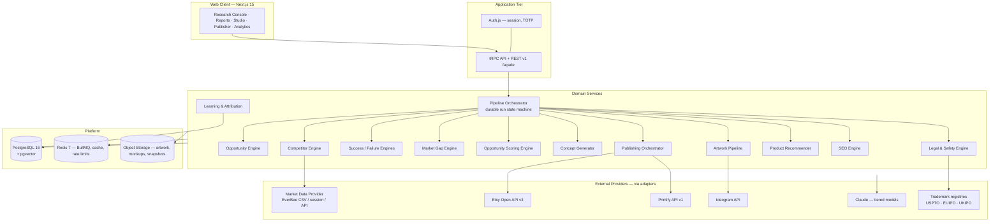

# 00 — Executive Summary

**Document owner:** CTO
**Version:** 1.0
**Status:** Approved for build planning
**Audience:** Engineering team, founder/operator, future investors

---

## 1. The problem

Etsy Print-On-Demand (POD) is a market where the *cost of production is near zero* and the *cost of attention is everything*. A seller can list 500 designs for almost no marginal cost, which means the constraint is not manufacturing — it is **knowing which design, in which niche, with which visual style, at which price, described with which keywords, will sell.**

Today the overwhelming majority of POD sellers operate on intuition:

1. They pick a niche because it feels popular.
2. They generate designs because they like them.
3. They copy the visual language of whatever listing happened to be on page one.
4. They write listings by imitating a competitor's title.
5. They publish, wait, and cannot explain why 3% of listings produce 90% of revenue.

The information needed to do better *already exists in public and semi-public data* — Etsy listing metadata, review counts and velocity, shop ages, price points, image counts, estimated sales from tools such as EverBee — but it is scattered, unstructured, and never connected back to the design decision itself.

**The gap is not data. The gap is the loop between data and creation.**

## 2. The product

**POD Intelligence** closes that loop. It is a single operator's private research-and-production system that:

1. **Scores a niche before you invest in it** — a 0–100 Opportunity Score built from demand, competition, trend, profitability and seasonality sub-scores, with full reasoning and evidence.
2. **Reads the market quantitatively** — up to 20 competitor shops and every relevant listing they hold, structured into a queryable dataset (price, sales estimate, revenue estimate, image count, reviews, review velocity, listing age, shop age, bestseller flags).
3. **Reads the market *visually*** — palette extraction, typography classification, layout archetype detection and mockup-style tagging on competitor thumbnails, turning aesthetics into statistics.
4. **Separates signal from noise** — a Success Analysis Engine and a Failure Analysis Engine producing weighted, statistically-qualified factor lists ("84% of top-decile listings use muted green palettes; 91% use 8+ images") *and* the anti-patterns ("62% of bottom-decile listings price below £14.50 with paid shipping").
5. **Finds the white space** — a Market Gap Engine that maps sub-niche coverage against sub-niche demand and ranks the underserved intersections.
6. **Generates original concepts, not copies** — 10 concepts derived from success factors and 10 derived from market gaps, each with audience, style, reasoning and a estimated Opportunity Score before a single pixel is rendered.
7. **Screens for legal risk before generation** — trademark, copyright, and Etsy-policy screening as a hard gate, not an afterthought.
8. **Produces print-ready artwork** — Ideogram-generated, background-removed, upscaled, DPI-validated, optionally vectorised, with a full print-readiness QA report.
9. **Builds the listing** — product/blueprint recommendation, pricing with margin modelling, and 10 regenerable SEO listing variations (title, description, 13 tags, keyword rationale, positioning).
10. **Publishes safely** — Printify product creation with variant and mockup handling, Etsy **draft** listing creation, and a mandatory human Final Review gate before anything goes live.
11. **Learns** — every published product's real sales, views and favourites flow back and recalibrate the scoring weights, so the system's opinion of "what works" is derived from *your* outcomes, not just market snapshots.

## 3. Strategic thesis

> The durable asset is not the AI-generated art. It is the **proprietary outcome dataset** linking design attributes → market conditions → realised sales.

Anyone can call an image model. Almost nobody has a clean, longitudinal dataset that says *"in the gardening/composting sub-niche, muted-earth palettes with condensed vintage serif typography on a natural-colour heavyweight tee, priced at £22.95 with free shipping, converted at 2.3× the niche baseline."*

That dataset is:
- Impossible to buy.
- Compounding — it improves monotonically with usage.
- The moat when this becomes a SaaS product, because a new entrant starts at zero while POD Intelligence starts with N shops × M months of ground truth.

Therefore the architecture treats **event capture and outcome attribution as first-class**, not as an analytics afterthought. Every score, prompt, model version, generated asset and published listing is persisted with lineage so that any historical decision can be replayed and re-scored under a new model.

## 4. System at a glance

## 5. The ten architectural decisions that matter

| # | Decision | Rationale | ADR |
|---|---|---|---|
| 1 | **Workspace-scoped schema from commit #1** | Every table carries `workspace_id`. Single-user mode is "one workspace". Retrofitting tenancy later is a 6-month rewrite; doing it now costs one column. | [ADR-0001](adr/ADR-0001-multi-tenancy-from-day-one.md) |
| 2 | **PostgreSQL as the single source of truth**, including vectors (`pgvector`) and search (`tsvector` + `pg_trgm`) | One durable store until scale demands otherwise. Avoids premature Elasticsearch/Pinecone operational burden. | [ADR-0002](adr/ADR-0002-postgres-as-primary-store.md) |
| 3 | **Durable, resumable pipeline runs** — every pipeline is a persisted state machine (`runs` + `run_steps`), not an in-memory job chain | A research run costs real money (LLM + image credits) and takes minutes. Crashes must resume, not restart. Temporal is the escape hatch at scale. | [ADR-0003](adr/ADR-0003-durable-run-orchestration.md) |
| 4 | **Provider adapter boundary** — no vendor SDK is imported outside `packages/adapters/*` | EverBee has no public API; Etsy/Printify change; Ideogram may be swapped. Adapters make the volatile parts replaceable and testable with recorded fixtures. | [ADR-0004](adr/ADR-0004-provider-adapter-boundary.md) |
| 5 | **Deterministic maths, LLM judgement** — all scores are computed in TypeScript from stored features; LLMs classify and explain but never invent a number | Reproducibility, auditability, and the ability to re-score history when weights change. | [ADR-0005](adr/ADR-0005-deterministic-scoring-llm-judgement.md) |
| 6 | **Versioned scoring configuration** — weights live in `scoring_configs` rows, and every score persists the config version that produced it | Enables the learning loop and honest A/B comparison of model changes. | [ADR-0006](adr/ADR-0006-versioned-scoring-config.md) |
| 7 | **Structured AI output only** — every LLM call is bound to a JSON Schema with validation + repair; free-text is a rendering concern | Eliminates the largest class of AI integration bugs. | [ADR-0007](adr/ADR-0007-structured-ai-output.md) |
| 8 | **Human-in-the-loop at three gates** — concept selection, legal clearance, and final publish | Legal exposure and brand risk are unacceptable to automate away. | [ADR-0008](adr/ADR-0008-human-gates.md) |
| 9 | **Compliance-ranked data acquisition** — operator CSV import is the default, guaranteed path; automated collection is opt-in, rate-limited, and documented | Scraping-dependent architectures die when the target changes. The CSV path never breaks. | [ADR-0009](adr/ADR-0009-market-data-acquisition-posture.md) |
| 10 | **Cost as a first-class budget** — every run carries a token/credit budget, tracked per step, enforced before spend | AI cost is the dominant variable cost and the thing that kills unit economics in SaaS. | [ADR-0010](adr/ADR-0010-ai-cost-budgeting.md) |

## 6. Scope boundaries (Phase 1, single user)

**In scope:** all 16 workflow steps, one Etsy shop, one Printify account, one operator, English-language listings, GBP/USD, T-shirts / hoodies / mugs / posters / tote bags / sweatshirts.

**Explicitly out of scope for Phase 1:** multi-user, billing, teams, mobile app, non-Etsy marketplaces (Amazon Merch, Redbubble), automated ad-spend management, physical inventory, customer service automation, non-English listings.

**Architected-for but not built in Phase 1:** subscriptions, Stripe, team roles, per-workspace usage metering, public API, marketplace-agnostic listing model.

## 7. Success criteria for the build

| Dimension | Target |
|---|---|
| Time from niche input to ranked Opportunity Report | < 4 minutes p95 |
| Time from approved concept to Etsy draft listing | < 12 minutes p95 |
| Operator time per published product | < 8 minutes of active attention |
| Research run cost (AI + data) | < £1.20 per full niche run |
| Artwork cost per accepted design | < £0.60 including retries |
| Publish success rate (draft created without manual fix) | > 95% |
| Scoring reproducibility | 100% — re-running a stored run with the same config version yields identical scores |
| Data loss tolerance | Zero for runs, concepts, artwork, listings (RPO ≤ 5 min) |

## 8. Unit economics model (single user, monthly)

| Line | Assumption | Cost |
|---|---|---|
| Hosting — web (Vercel Pro) | 1 project | £16 |
| Hosting — worker (Fly.io, 1× shared-2x) | always-on | £9 |
| Postgres (Neon Scale / Supabase Pro) | 10 GB, PITR | £20 |
| Redis (Upstash pay-as-you-go) | ~2M commands | £8 |
| Object storage (R2) | 50 GB + egress | £5 |
| Claude API | ~30 research runs + ~200 concept/SEO calls | £28 |
| Ideogram | ~250 generations incl. retries | £22 |
| EverBee subscription | operator-held | £16 |
| Monitoring (Sentry + Grafana free tiers) | — | £0 |
| **Total** | | **≈ £124/mo** |

At SaaS Stage 3 (see doc 16) the dominant marginal cost per active workspace is Claude + Ideogram at roughly **£0.90–£3.40 per published product**, which sets the pricing floor. See [doc 21 §4](21-saas-migration-strategy.md) for the pricing model derived from this.

## 9. Delivery plan headline

| Phase | Name | Duration | Outcome |
|---|---|---|---|
| 0 | Architecture (this document set) | done | Approved specification |
| 1 | Foundation | 3 weeks | Monorepo, DB, auth, orchestrator, UI shell, adapters with fixtures |
| 2 | Intelligence Core | 5 weeks | Steps 1–6: opportunity, competitor, success, failure, gap engines + reports |
| 3 | Creative Core | 4 weeks | Steps 7–10: predictor, concepts, legal gate, artwork pipeline |
| 4 | Commerce Core | 4 weeks | Steps 11–15: product recommender, SEO, Printify, Etsy, final review |
| 5 | Feedback Core | 3 weeks | Step 16: analytics, performance sync, learning loop, weight recalibration |
| 6 | SaaS Readiness | 4 weeks | Multi-user, Stripe, teams, metering, public API |

Total to a fully functioning single-user system: **19 weeks**. See [doc 19](19-development-roadmap.md) for sprint-level detail.

## 10. What would make this fail

Stated plainly, so the team designs against it:

1. **EverBee data access breaks or is legally constrained.** Mitigated by the provider abstraction and CSV-first posture (doc 11). The system must remain useful with *only* Etsy public data + operator CSV.
2. **Etsy policy changes on AI-generated art or on API-driven listing creation.** Mitigated by human-gated publishing, draft-only automation, and an abstracted listing model.
3. **AI cost per useful design exceeds product margin.** Mitigated by hard budgets, model tiering, aggressive caching, and concept-before-artwork gating.
4. **The learning loop never gets enough data to be better than heuristics.** Mitigated by designing the loop to degrade gracefully to a prior — the system is useful on day one with expert-set weights and improves from there.
5. **Scope creep into a general "AI store builder".** Mitigated by the explicit scope boundaries in §6 and the roadmap gate criteria.

Full register in [doc 20](20-risks-and-mitigations.md).
