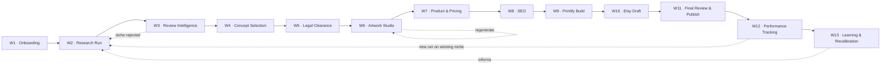
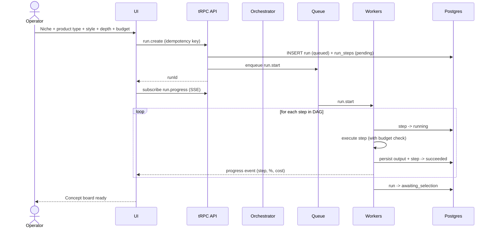
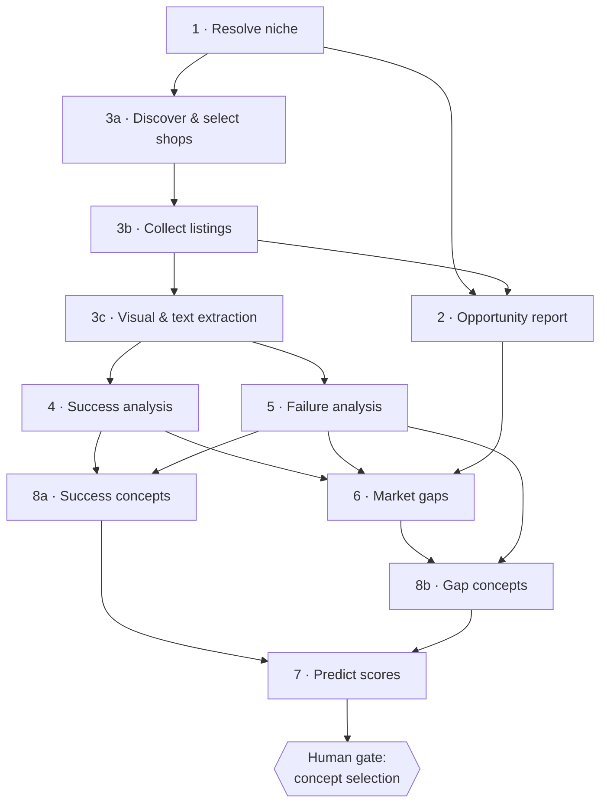
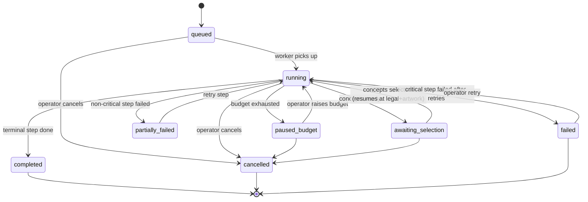
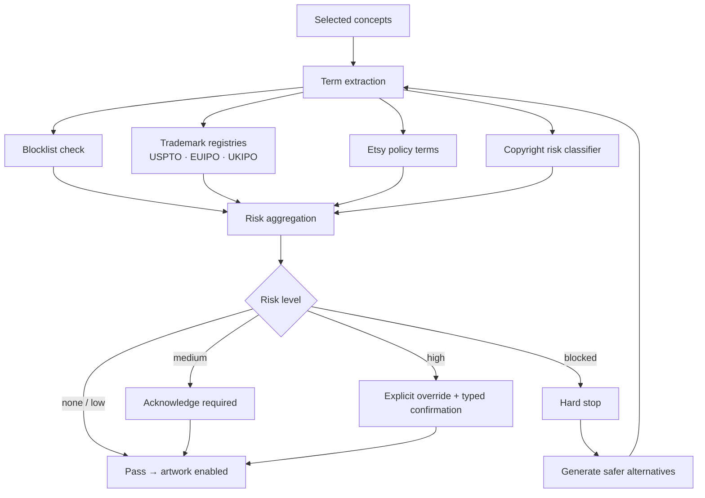
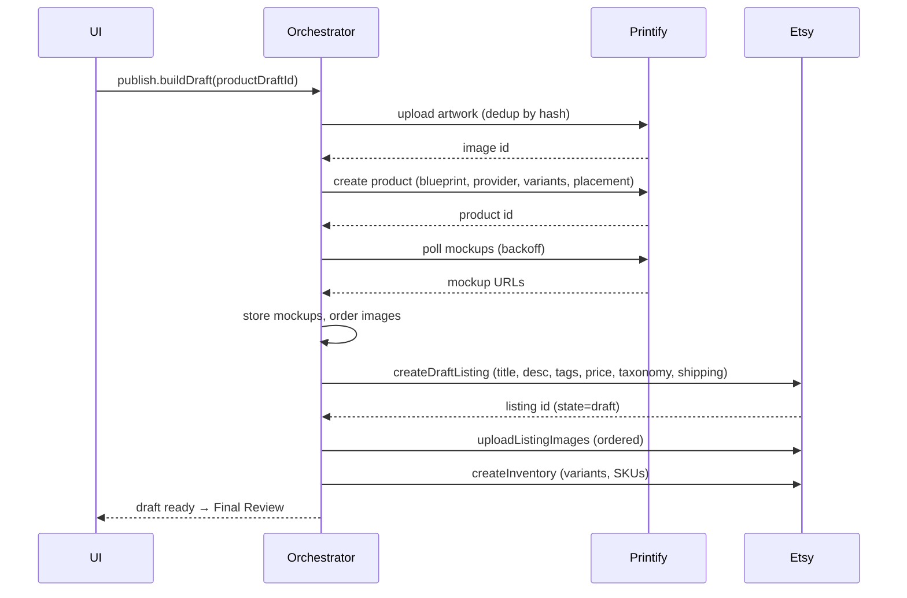
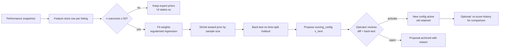

# 04 — User Workflows

**Version:** 1.0

This document defines the operator's journeys, the state machines behind them, and the behaviour on every non-happy path.

---

## 1. Workflow map

---

## 2. W1 — Onboarding (first run only)

**Goal:** get from empty install to "ready to research" in under 10 minutes.

| Step | Screen | Action | System behaviour |
|---|---|---|---|
| 1 | Create Account | Set email + password, enrol TOTP | Argon2id hash; TOTP secret encrypted; recovery codes shown once |
| 2 | Workspace Setup | Name, base currency, country, VAT status | Creates the single workspace; seeds default `scoring_config` v1 (expert priors) |
| 3 | Connect Etsy | OAuth (PKCE) | Redirect → callback → token exchange → encrypted store → shop metadata fetched → health check |
| 4 | Connect Printify | Paste API token, select shop | Validates token, fetches shops, caches blueprint catalogue in background |
| 5 | Connect Ideogram | Paste API key | Validation call; masked display thereafter |
| 6 | Market Data Source | Choose adapter: EverBee CSV import / assisted session / Etsy-public-only | Explains fidelity trade-off of each; stores choice; runs a capability probe |
| 7 | Economics | Fee model, margin floor (default 40%), monthly AI budget, per-run budget | Persists to workspace settings |
| 8 | Ready | Summary of connection health | Offers "Start your first research run" |

**Skippable:** steps 3–5 can be deferred; the app runs in *research-only mode* and marks publishing features unavailable with a clear reason.

**Failure paths:** OAuth denial → explanatory screen with retry; invalid token → inline field error naming the failing check; Printify with no connected shop → warning that publishing via bridge is unavailable.

---

## 3. W2 — Research Run (Steps 1–8)

### 3.1 Journey

### 3.2 Step DAG and parallelism

Steps 4 and 5 run in parallel. 8a and 8b run in parallel. Step 2 refines once 3b delivers real competitor data (it emits a provisional score early for perceived speed, then a final score — both versions are persisted and the UI shows the transition explicitly).

### 3.3 Run state machine

**Step state machine:** `pending → running → (succeeded | failed | skipped | blocked_external | cancelled)`; `failed → running` on retry, with `attempt` incremented and prior attempt output retained.

### 3.4 Operator controls during a run

- **Cancel** — stops scheduling, signals in-flight jobs, preserves completed outputs, marks run `cancelled` within 10 s.
- **Pause/Resume** — drains to a safe boundary.
- **Raise budget** — inline, when paused at cap.
- **Skip step** — allowed only for optional steps (failure analysis, gap analysis, visual extraction); records the skip and the degradation it causes.
- **Watch cost** — live meter with per-step breakdown.

### 3.5 Degradation matrix

| Failure | Run outcome | User sees |
|---|---|---|
| Market data provider returns 0 shops | Continue on Etsy-public data | Amber banner: "Reduced fidelity — sales estimates unavailable. Import an EverBee CSV to upgrade this report." + one-click import |
| < 20 but ≥ 10 shops qualify | Continue at 10 | Info note explaining the fallback ladder |
| < 5 shops qualify | Continue, mark `degraded` | Warning that statistics are indicative only; factors below n threshold suppressed |
| Vision model failure on some images | Continue | "Style analysis available for 284 of 312 listings (91%)" |
| Trend data unavailable | Trend sub-score `low` confidence, fallback to review-velocity proxy | Sub-score badge shows `estimated` with method named |
| LLM schema failure | Repair → retry → step fails | Step card shows failure with "View raw output" and Retry |
| Budget exhausted | Run pauses | Modal with spend breakdown and raise-budget action |

---

## 4. W3 — Review Intelligence (Steps 2–6 outputs)

**Goal:** the operator forms a go/no-go judgement in under five minutes.

Recommended reading order enforced by the UI's tab order and a "next" affordance:

1. **Opportunity** — is this market worth it? → verdict band, radar, sub-niche ranking.
2. **Competitors** — who is winning? → shop table, listing table, distributions.
3. **Success** — what works here? → weighted factors, synthesis card.
4. **Failure** — what fails here? → anti-factors, Do/Avoid sheet.
5. **Gaps** — where is the space? → bubble map, ranked gaps.

**Decision points:**
- *Proceed* → go to Concepts.
- *Refine* → clone the run with a narrower sub-niche (pre-fills the wizard with the chosen sub-niche as the niche).
- *Reject* → mark niche `rejected` with a reason; it appears in a "considered and rejected" list so the operator never re-researches it blindly.
- *Deepen* → upgrade a `quick`/`standard` run to `deep`, reusing all existing data and only fetching the delta.

---

## 5. W4 — Concept Selection (human gate 1)

| Action | Behaviour |
|---|---|
| View board | 20 cards: 10 `success`-origin, 10 `gap`-origin, sortable by any predictor sub-score, filterable by origin/sub-niche/style |
| Inspect | Drawer with full description, audience, visual direction, reasoning, per-dimension score contributions, and the exact factors/gaps cited |
| Select | Multi-select; running total of estimated artwork cost updates live |
| Regenerate one | Optional steer text; replaces that card, preserving others |
| Regenerate all | Confirmation showing cost; prior set retained as a version |
| Add manual | Form → predictor → legal, same as generated concepts |
| Expand | "More like this" produces 5 variants along a chosen axis |
| Proceed | Enqueues legal screening for selected concepts only |

**Gate rule:** no artwork job can exist without a selected concept. Enforced in the service layer (FR-807, FR-901).

---

## 6. W5 — Legal Clearance (human gate 2)

**UI behaviour:** each concept shows a risk chip. Expanding reveals matched terms, each matched registration (number, owner, class, jurisdiction, status, link) and the rationale. Safer alternatives appear as accept-and-replace cards. Overrides record the operator, timestamp and a free-text justification into the immutable audit log.

---

## 7. W6 — Artwork Studio

| Stage | Operator action | System |
|---|---|---|
| Brief | Review/edit the generated brief | Persists brief version |
| Generate | Choose variant count (default 4), press Generate | Ideogram call per variant, live thumbnails as they land |
| Compare | Side-by-side with zoom, transparency proof toggle | — |
| QA | Read the print-readiness panel | DPI, alpha, stroke width, colour count, gamut, edge quality — pass/warn/fail per criterion |
| Fix | Upscale · remove background · auto-crop · vectorise | Each produces a new derived asset; history preserved |
| Originality | Read similarity report | Nearest competitor thumbnail with distance; > 0.94 blocks without acknowledgement |
| Accept | Select the winning variant | Artwork → `accepted`, unlocks Product step |
| Reject all | Regenerate with steer, or return to concept | Costs counted; budget enforced |

**Non-happy paths:** provider outage → step `blocked_external`, concept stays queued, retry button with breaker status; QA fail → the failing criterion is named with a specific remedy; all four variants rejected twice → suggestion to revise the brief with concrete diagnostics.

---

## 8. W7 — Product & Pricing

1. Ranked configuration table (blueprint × provider × variants) with demand/competition/profit sub-scores.
2. Operator selects a configuration; colour recommendations are validated against artwork ink (dark-on-dark warnings).
3. Pricing panel: cost breakdown, target margin slider, competitor price distribution overlay with the chosen price marked, free-shipping toggle with price-inclusive recalculation.
4. Margin floor violation → blocked with an explanation and the price required to clear the floor.

---

## 9. W8 — SEO

1. Ten variations render as cards, each labelled with its differentiation axis and its computed quality score.
2. Inline editing with live validators (title ≤ 140, exactly 13 tags, each ≤ 20 chars, no duplicates).
3. Keyword evidence drawer: for each keyword, which competitor listings used it and what they earned.
4. Per-variation regenerate with steer; whole-set regenerate.
5. Select one variation → becomes the draft's listing content. The other nine are retained for later experiments.

---

## 10. W9–W10 — Printify Build & Etsy Draft

**Partial-failure handling:** each sub-operation has its own idempotency key and status. If images fail after listing creation, the draft is `partial` and "Retry images" repairs only that portion — never re-creating the listing.

---

## 11. W11 — Final Review & Publish (human gate 3)

**Screen contents:** concept summary · artwork with transparency proof · mockup gallery · product configuration and variants · pricing table · itemised profit estimate · selected SEO in an Etsy-like preview · legal status · Opportunity Score · pre-publish checklist.

**Checklist (publish disabled until all hard items pass):**

| Check | Hard/Soft |
|---|---|
| Legal cleared (or overridden with record) | Hard |
| Artwork QA passed | Hard |
| Originality check passed/acknowledged | Hard |
| Margin ≥ floor | Hard |
| Title ≤ 140 chars, non-empty | Hard |
| Exactly 13 tags, each ≤ 20 chars | Hard |
| Taxonomy + shipping profile set | Hard |
| Image count ≥ recommended band | Soft (warn) |
| Price within competitor IQR | Soft (warn) |
| Description ≥ 400 chars | Soft (warn) |

**Publish:** confirmation dialog naming the shop and the action → Etsy state transition to `active` → audit record → first performance sync scheduled at T+24 h.

---

## 12. W12 — Performance Tracking

- Daily scheduled sync per published listing: views, favourites, orders, revenue, state.
- Derived metrics computed on write; percentiles recomputed nightly.
- Dashboard surfaces: top/bottom performers, days-to-first-sale distribution, concept-origin comparison (success-derived vs gap-derived), predicted-vs-actual scatter.
- Alerts: first sale, listing deactivated by Etsy, zero views after 14 days (SEO problem signal), sudden ranking drop.

---

## 13. W13 — Learning & Recalibration

**Guarantees:** never auto-activated; always reversible; historical scores are never mutated in place — re-scoring writes new score rows tagged with the new config version.

---

## 14. Cross-cutting operator workflows

| Workflow | Description |
|---|---|
| **Run history & diff** | Compare two runs of the same niche across time: which factors changed, which competitors entered/exited, how the opportunity score moved |
| **Re-run with delta** | Refresh a niche's competitor data without redoing analysis that hasn't changed |
| **Global search** | One search box across niches, runs, concepts, artwork, listings |
| **Cost review** | Spend by run/provider/month against caps, with the most expensive steps highlighted |
| **Integration health** | Connection status, token expiry, quota consumption, last error per provider |
| **Export** | PDF report / CSV data / full workspace archive |
| **Recover deleted** | 30-day soft-delete restore |

---

## 15. Notification triggers

| Event | Channel | Priority |
|---|---|---|
| Run completed / concepts ready | In-app + email | Normal |
| Run failed | In-app + email | High |
| Budget 80% / 100% | In-app + email | High |
| Legal block or high-risk flag | In-app | High |
| Artwork batch ready | In-app | Normal |
| Etsy draft created / publish succeeded | In-app | Normal |
| Publish failed / token revoked | In-app + email | Critical |
| First sale on a published listing | In-app | Normal (delight) |
| New scoring config proposed | In-app | Normal |
