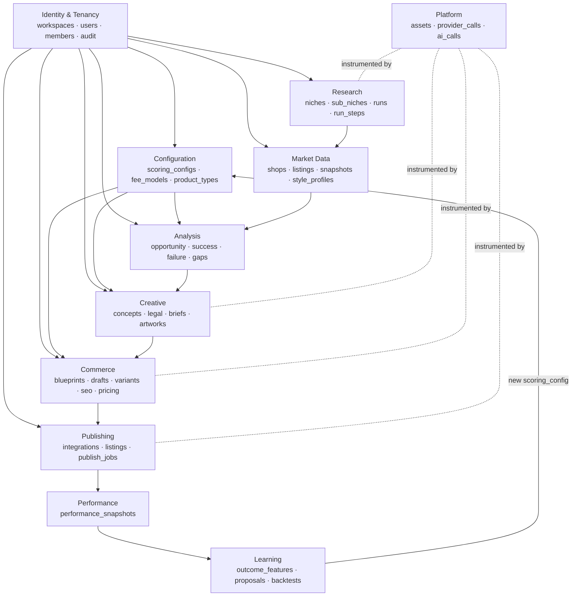
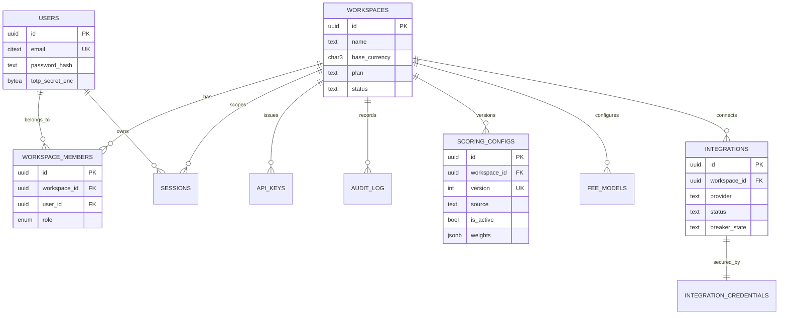
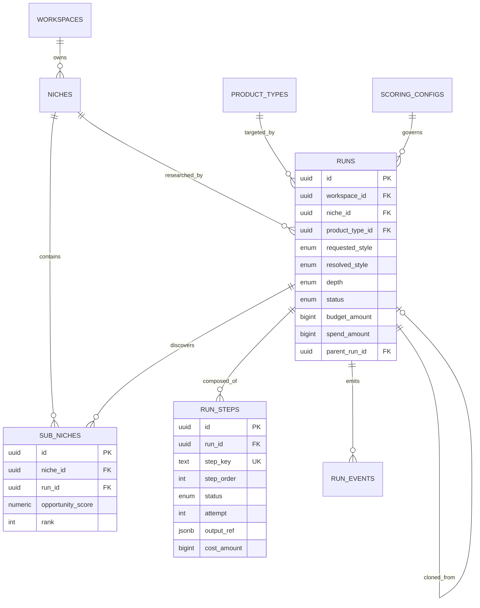
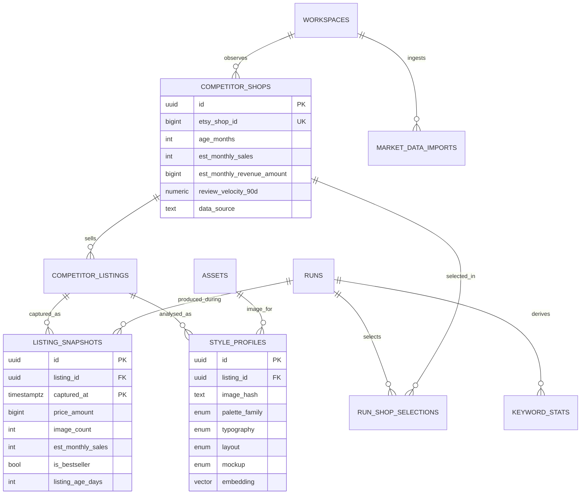
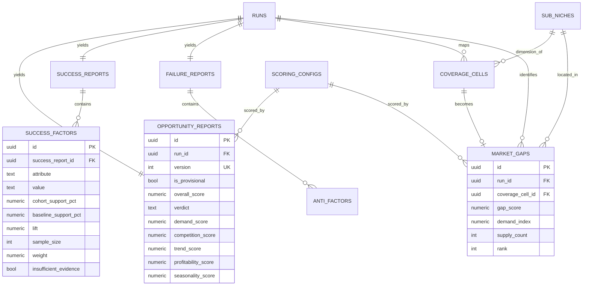
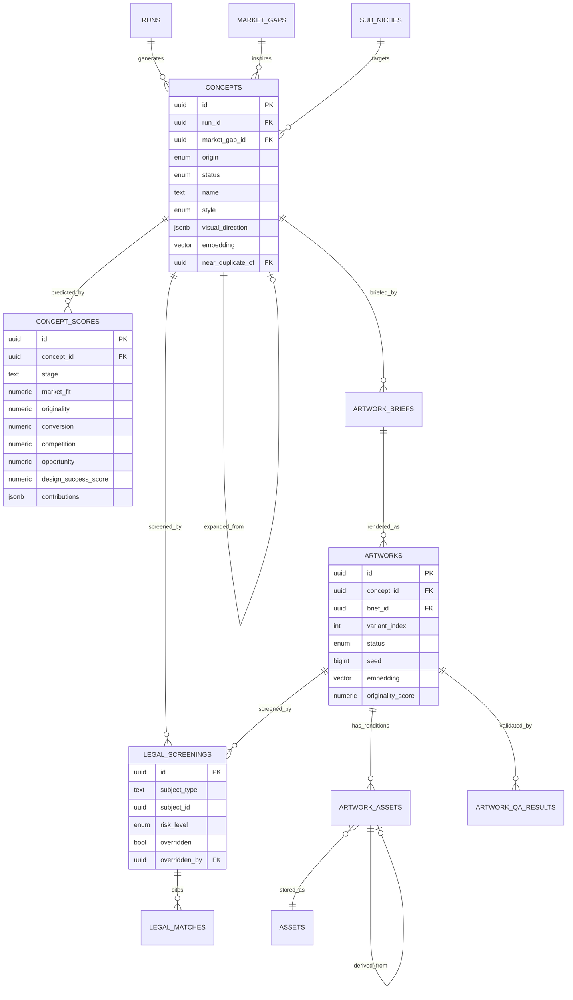
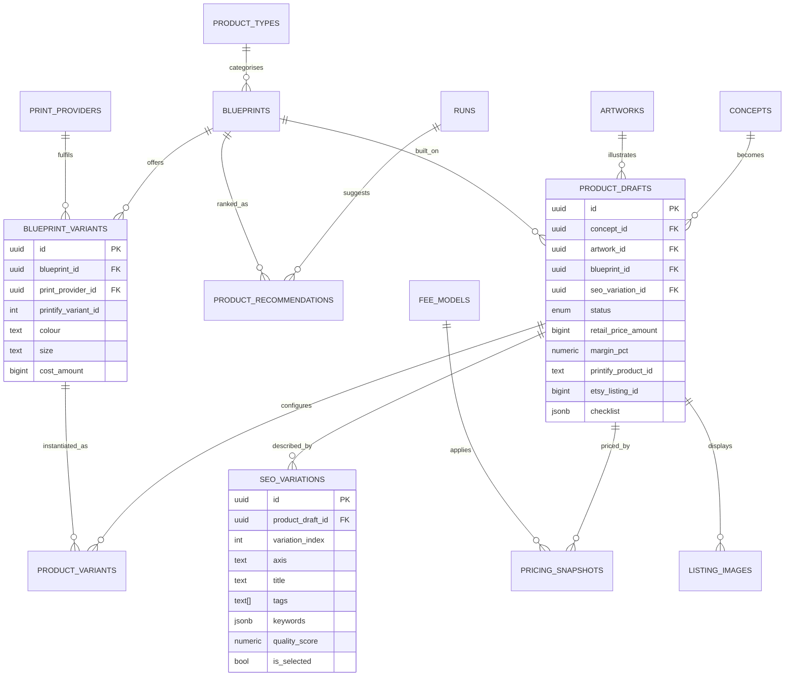
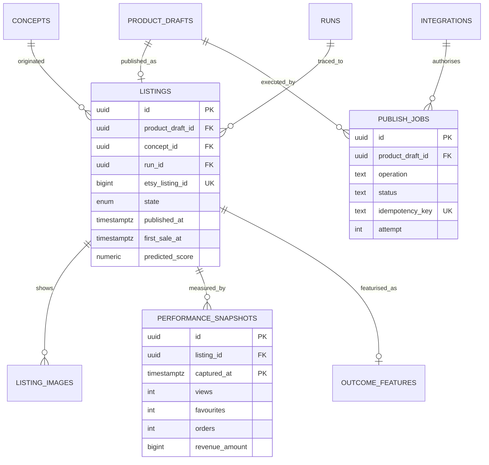
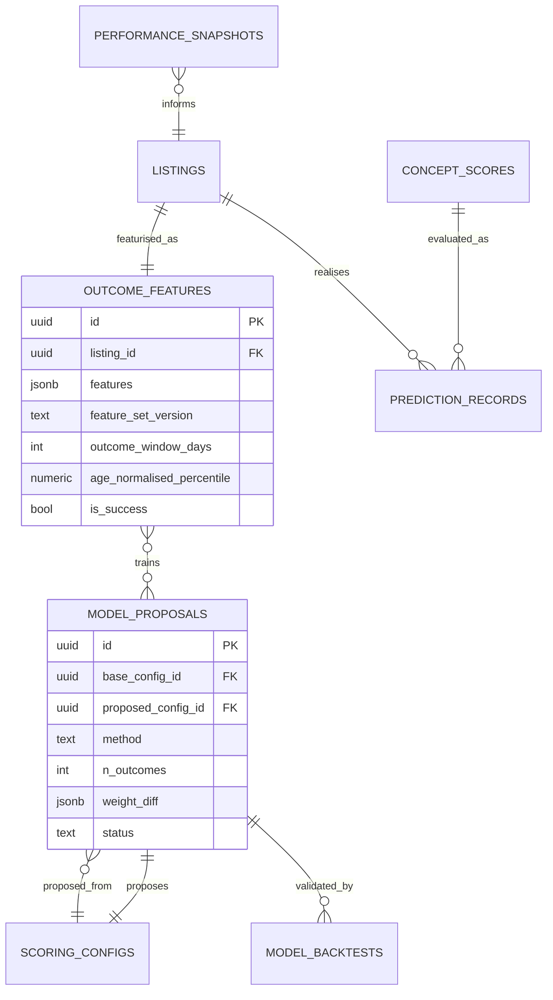
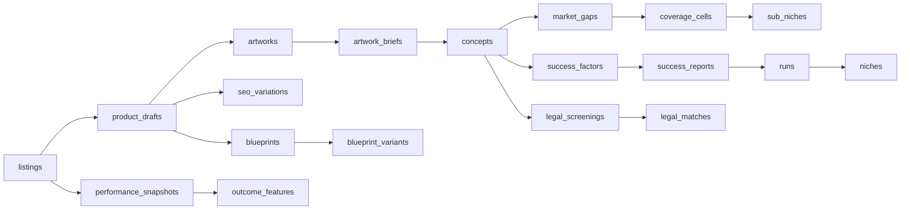

# 07 — Entity Relationship Diagrams

**Version:** 1.0 · Diagrams are grouped by domain because a single ERD across ~55 tables is unreadable. Cardinalities use crow's-foot notation via Mermaid.

---

## 1. High-level domain map

---

## 2. Identity, tenancy & configuration

**Notes**
- `workspace_members` exists in Phase 1 with exactly one `owner` row. Multi-user is purely additive.
- `scoring_configs` has a partial unique index guaranteeing at most one active config per workspace.
- Credentials are separated from `integrations` so the metadata table can be read freely without touching ciphertext.

---

## 3. Research & orchestration

**The `runs → run_steps` relationship is the backbone of the system.** Every unit of work, cost, retry and output pointer hangs off `run_steps`. `output_ref` is a `{table, id}` pointer rather than 15 nullable FK columns, keeping the step table generic while remaining traceable.

---

## 4. Market data

**Design points**
- `competitor_shops` and `competitor_listings` are *identity* tables (stable facts). All *volatile* facts live in `listing_snapshots`, which is immutable and time-partitioned. This is what makes longitudinal analysis and re-analysis-without-refetch possible.
- `style_profiles` is keyed by `(workspace_id, image_hash, extractor_version)` so the same image is analysed once and reused across runs — the single largest vision-cost saving.
- `run_shop_selections` is the join that records *why* a shop was chosen, not just that it was.

---

## 5. Analysis

**Versioning:** `opportunity_reports` carries `version` and `is_provisional` so the early provisional score and the final score coexist and can be compared. Reports are never updated in place.

---

## 6. Creative

**Two things worth noting:**
1. `concept_scores` is *append-only with a `stage` discriminator*, so the concept-stage prediction and the artwork-stage prediction are both retained. This is what makes the calibration analysis in doc 5 §3.15 possible.
2. `legal_screenings` uses a polymorphic `(subject_type, subject_id)` because concepts, artworks and listing text all need screening with identical semantics. This is the one place polymorphism is accepted, and it is guarded by a check constraint on `subject_type`.

---

## 7. Commerce

**`product_drafts` is the convergence point** of the entire system — concept, artwork, blueprint, pricing and SEO all meet here, and it is the entity the Final Review page renders.

---

## 8. Publishing & performance

`publish_jobs` decomposes publishing into seven independently idempotent operations, which is what makes partial-failure recovery (FR-1410) possible without duplicate listings.

---

## 9. Learning loop

**The cycle:** `listings → performance_snapshots → outcome_features → model_proposals → scoring_configs → (next run's) concept_scores`. Every arrow is an explicit table, so the loop is inspectable rather than hidden inside a training script.

---

## 10. Full lineage chain (the traceability guarantee)

Any published listing can be traced backwards through a single chain of foreign keys:

**Requirement:** the Listing Detail page (doc 5 §3.14) renders this chain as clickable breadcrumbs. If any link cannot be resolved, that is a data-integrity defect caught by the nightly consistency job (NFR §2.2).

---

## 11. Cardinality reference

| Relationship | Cardinality | Notes |
|---|---|---|
| workspace → everything | 1:N | Tenancy root |
| niche → runs | 1:N | Re-researchable over time |
| run → run_steps | 1:N (≈14) | Fixed by the DAG for a given depth |
| run → competitor_shops | N:M via `run_shop_selections` | Shops are shared across runs |
| competitor_listing → listing_snapshots | 1:N | Immutable time series |
| competitor_listing → style_profiles | 1:N | One per extractor version |
| run → success_report | 1:1 | Regeneration creates a new run or a new report version |
| success_report → success_factors | 1:N (10–40) | Ranked |
| run → concepts | 1:N (20 base + expansions) | |
| concept → concept_scores | 1:N | One per stage per config version |
| concept → legal_screenings | 1:N | Re-screened on edit |
| concept → artwork_briefs | 1:N | Versioned |
| artwork_brief → artworks | 1:N (1–8) | Variants |
| artwork → artwork_assets | 1:N (4–7) | Rendition tree |
| concept + artwork → product_draft | 1:1 typical, 1:N possible | Same artwork can back several products |
| product_draft → seo_variations | 1:N (10) | Exactly one selected |
| product_draft → listing | 1:0..1 | Only after publish |
| listing → performance_snapshots | 1:N (daily) | |
| listing → outcome_features | 1:N | One per window × feature-set version |

---

## 12. Referential-integrity rules

| Rule | Enforcement |
|---|---|
| Deleting a workspace cascades everything | `ON DELETE CASCADE` from `workspaces` |
| Deleting a run must NOT delete shared market data | `runs → competitor_shops` is via join table; snapshots keep `run_id` nullable-on-delete |
| Deleting a concept cascades briefs/artworks/screenings | `ON DELETE CASCADE` |
| A published listing can never be hard-deleted | Soft delete only; DB trigger rejects `DELETE` on `listings` with `published_at IS NOT NULL` |
| `product_drafts.seo_variation_id` must reference a variation belonging to the same draft | Deferred check via trigger |
| `artworks.concept_id` must match `artwork_briefs.concept_id` | Composite FK on `(concept_id, brief_id)` |
| An artwork cannot be attached to a draft unless its latest QA result is `pass` | Enforced in the service layer + a nightly consistency assertion |
| A concept cannot have artwork unless its latest screening passed | Enforced in the service layer (FR-901) + nightly assertion |
