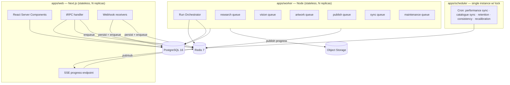

# 09 — Service Architecture

**Version:** 1.0

---

## 1. Deployment topology

Three deployable units in Phase 1. Deliberately not microservices — a modular monolith with a separate worker process gives us bounded contexts without distributed-transaction pain, and the module boundaries are already drawn where the seams would go.



**Why a separate worker process:** research runs take minutes and consume 100% of a CPU during statistics and image processing. Colocating them with request serving would make p95 latency unpredictable and make scaling the two workloads independently impossible.

**Why a separate scheduler:** exactly-once cron semantics require a leader; a tiny dedicated process holding a Redis lock is simpler and more debuggable than leader election inside the worker fleet.

---

## 2. Internal module boundaries

```
packages/domain          pure functions — scoring, statistics, pricing, validators, ranking
packages/db              Prisma client, repositories, transactions, RLS session
packages/queue           queue abstraction (BullMQ impl), job registry, DLQ
packages/adapters/*      etsy · printify · ideogram · ai · marketdata · trademark · storage
packages/orchestrator    run DAG definition, step runner, budget guard, resume logic
packages/engines/*       opportunity · competitor · style · success · failure · gap ·
                         predictor · concept · legal · artwork · product · seo · learning
packages/observability   logging, tracing, metrics, cost telemetry
packages/contracts       shared Zod schemas + types used by API and engines
```

**Dependency rule (enforced by `dependency-cruiser` in CI):**

```
apps/*  →  packages/engines  →  packages/domain
                ↓                     ↑
        packages/adapters ────────────┘ (types only)
                ↓
        packages/db · packages/queue · packages/observability
```

- `packages/domain` imports **nothing** except standard library and `packages/contracts`. It is pure, synchronous, and fully unit-testable. All scoring maths lives here.
- `packages/engines` orchestrates: fetches via adapters/db, computes via domain, persists via db.
- No engine imports another engine directly; they communicate through the orchestrator and the database.

---

## 3. The Run Orchestrator

The single most important component. It turns a research run into a **durable, resumable, budget-bounded state machine**.

### 3.1 Model

```ts
type StepDefinition = {
  key: string
  order: number
  dependsOn: string[]
  optional: boolean                       // can be skipped without failing the run
  requiredDepths: RunDepth[]              // which depths include this step
  maxAttempts: number
  timeoutMs: number
  estimatedCostAmount: number
  queue: QueueName
  handler: (ctx: StepContext) => Promise<StepOutput>
}
```

The DAG is declarative data (`packages/orchestrator/dag.ts`), not control flow. Adding a step is a data change plus a handler.

### 3.2 Execution loop

```mermaid
sequenceDiagram
    participant Q as Queue
    participant SR as StepRunner
    participant BG as BudgetGuard
    participant H as Step Handler
    participant DB as Postgres
    participant PS as Redis pub/sub

    Q->>SR: {runId, stepKey, attempt}
    SR->>DB: SELECT run, step FOR UPDATE SKIP LOCKED
    SR->>SR: assert dependencies succeeded
    SR->>BG: reserve(estimatedCost)
    alt budget insufficient
        BG-->>SR: deny
        SR->>DB: run.status = paused_budget
        SR->>PS: publish run.status
    else allowed
        SR->>DB: step.status = running, attempt++
        SR->>PS: publish step.started
        SR->>H: execute(ctx)
        H-->>SR: output + actualCost
        SR->>DB: TX { persist output; step.succeeded; run.spend += cost }
        SR->>PS: publish step.completed
        SR->>Q: enqueue newly-unblocked steps
    end
```

**Key properties**

| Property | How |
|---|---|
| Durable | Every transition is a committed DB write. Process death loses at most one in-flight step. |
| Resumable | On restart, a reaper finds steps `running` with a stale heartbeat and requeues them at `attempt+1`. |
| Idempotent | Each handler writes its output keyed by `(run_id, step_key)` with an upsert; re-execution overwrites cleanly. External side effects carry their own idempotency keys. |
| Concurrent | Independent steps run in parallel; the runner enqueues every step whose dependencies are satisfied. `SKIP LOCKED` prevents double-processing. |
| Bounded | Budget reserved before execution, reconciled after. |
| Observable | Every transition emits a `run_event` row and a Redis pub/sub message. |
| Cancellable | Cancellation sets a Redis flag checked by handlers at safe points and before every external call. |

### 3.3 Heartbeats and reaping

Long steps (competitor collection, vision extraction) update `run_steps.updated_at` every 15 s. A maintenance job every minute finds steps `running` with `updated_at < now() - interval '3 minutes'` and no live worker lease, marks them `failed` with `reason=worker_lost`, and requeues if attempts remain.

### 3.4 Human gates

`awaiting_selection` is a first-class run status, not a paused job. The orchestrator stops scheduling, the run persists indefinitely, and `concept.select` re-enters the DAG at the legal-screening step. The same mechanism supports future gates without new machinery.

---

## 4. Queues

| Queue | Concurrency (Phase 1) | Jobs | Rationale |
|---|---|---|---|
| `research` | 4 | run.start, step.execute (analysis steps) | CPU-bound statistics |
| `vision` | 6 | style.extract batch, embedding.compute | External-latency-bound, batched |
| `artwork` | 2 | artwork.generate, bg.remove, upscale, vectorise | Expensive; low concurrency limits blast radius and spend |
| `publish` | 2 | printify.*, etsy.* | Strictly rate-limited upstream; low concurrency avoids 429 storms |
| `sync` | 3 | performance.sync, catalogue.sync, listing.resync | Background, low priority |
| `maintenance` | 2 | retention, consistency, reaper, partition management, search reindex | Off-peak |
| `notify` | 4 | email, webhook delivery | Fast, independent |

**Separation rationale:** an artwork backlog must never delay a publish; a slow registry lookup must never starve the analysis pipeline. Queue isolation is the cheapest form of bulkheading.

**Job configuration:** exponential backoff (base 2 s, factor 2, jitter ±20%, cap 5 min), attempts per job class, `removeOnComplete: 1000`, `removeOnFail: false` (DLQ handles it), priority levels for user-initiated vs scheduled work.

### 4.1 Job naming and payload discipline

```ts
// Payloads are ids, never entities. Handlers re-read from the DB.
type JobPayload = {
  workspaceId: string
  runId?: string
  stepKey?: string
  entityId?: string
  attempt: number
  correlationId: string
}
```
Rationale: payloads outlive deploys. Embedding a serialised entity means a schema change breaks queued jobs. Ids are stable.

---

## 5. Engine specifications

Each engine is a package exporting one `execute(ctx)` function plus its pure helpers.

### 5.1 Opportunity Engine
**Inputs:** niche, product type, competitor aggregate (if available), blueprint costs, trend signals.
**Process:** feature extraction → normalisation (per `scoring_config`) → five sub-scores in `packages/domain/scoring/opportunity.ts` → weighted overall → verdict band → sub-niche discovery (LLM + co-occurrence + taxonomy, merged and deduplicated) → per-sub-niche scoring and ranking → executive summary (LLM, constrained).
**Outputs:** `opportunity_reports`, `sub_niches`.
**Degradation:** any missing feature falls back to a documented proxy with `confidence=low` and `degraded=true`.

### 5.2 Competitor Engine
**Sub-steps:** `discover` → `select` → `collect` → `snapshot` → `assets`.
**Process:** query the market-data provider chain → score and rank shops → apply the 20/10/5 fallback ladder → collect listings per shop with per-shop caps → normalise into snapshots → download and hash thumbnails → dedupe assets.
**Concurrency:** shops processed in parallel with a per-provider rate limiter; failures isolated per shop (one bad shop never fails the step).

### 5.3 Style Extraction Engine
**Process:** for each unique `image_hash` without a profile at the current extractor version — deterministic palette (k-means in CIELAB via `sharp` + a small clustering routine), then a batched vision classification (≤ 12 images/call) for typography/layout/mockup/subject, then embedding computation.
**Cost control:** content-hash cache is checked first; typical cache hit rate after the third run in a niche exceeds 40%.

### 5.4 Success & Failure Engines
**Process:** cohort assignment by age-normalised sales percentile → per-attribute contingency tables → two-proportion z-tests and χ² for categoricals, Cliff's delta and optimal-band search for numerics → lift computation against baseline → confidence assignment from n and p → weight assignment → statement rendering (template-based, not LLM) → synthesis card → Spearman correlation matrix → interaction detection on the top factors.
**Purity:** 100% of the maths lives in `packages/domain/stats` and is property-tested. The LLM is used only for the optional narrative summary.

### 5.5 Gap Engine
**Process:** build coverage matrix (sub-niche × angle × style) → estimate demand per sub-niche → apply the demand floor → compute monetisability from observed price power → feasibility check → Gap Opportunity Score → rank → generate explanations and suggested angles → apply caution flags (trademark-heavy via the legal term list, seasonal-dead via the seasonality index, unprintable via a rules check).

### 5.6 Predictor Engine
**Process:** assemble the feature vector for a concept (attributes × success factors × anti-factors × gap position × embedding distances) → compute five sub-scores deterministically → weighted Opportunity Score → contribution vector → reasoning rendered from contributions.
**Model:** linear with expert priors initially; the fitted model (Phase 5) replaces the coefficient set but not the interface.

### 5.7 Concept Engine
**Process:** build a compact grounding context (top N factors, top M gaps, style decision, sub-niche list, excluded terms, workspace history summary) → two parallel generation calls (success-derived, gap-derived) with structured output → validate schema → embed → dedupe within-run and against history → regenerate to fill quota → persist with prompt version and citations.
**Guard:** the grounding context contains **no competitor identifiers, titles or image references** — only aggregate attribute statistics.

### 5.8 Legal Engine
**Process:** entity extraction (LLM, structured) → normalisation → internal blocklist → registry lookups in parallel (USPTO, EUIPO, UKIPO) with a 30-day cache → Etsy policy term match → copyright risk classification (LLM, structured, with a rubric) → risk aggregation by a deterministic rule table → safer-alternative generation for anything above `low` → persist screening + matches.
**Rule table** (deterministic, not LLM-decided): exact mark match in a relevant Nice class with live status → `blocked`; fuzzy match ≥ 0.9 in class → `high`; exact match out of class → `medium`; blocklist term → `blocked`; celebrity/character likeness → `high`; quoted lyrics/dialogue → `high`; generic descriptive phrase → `low`.

### 5.9 Artwork Engine
**Pipeline:** brief compile → generate (N variants, parallel, rate-limited) → background removal → upscale → auto-crop → QA → renditions → embedding → originality check → optional vectorisation.
Each stage is a separate job so a failure at, say, vectorisation does not discard a successful generation.

### 5.10 Product & Pricing Engine
**Process:** filter blueprint catalogue by product type and workspace whitelist → compute demand/competition/profitability per configuration → price solve (target-margin or fixed-price mode) against the fee model → validate against margin floor → colour recommendation with artwork-compatibility check → rank.
**Purity:** the entire fee stack and price solve is in `packages/domain/pricing` with exhaustive tests including rounding and currency edge cases.

### 5.11 SEO Engine
**Process:** assemble keyword pool (competitor tags weighted by TF-IDF and sales, sub-niche terms, seed keywords) → generate 10 variations along declared axes (structured output) → hard-validate Etsy constraints → auto-repair once → score quality → rank → screen text through the legal term check.

### 5.12 Publishing Engine
**Process:** seven idempotent operations recorded in `publish_jobs`, each with its own key, retry policy and error mapping. State machine on `product_drafts.status`. Partial failures are repairable per-operation.

### 5.13 Learning Engine
**Process (scheduled weekly):** build/refresh `outcome_features` → check minimum n → time-split → fit → shrink toward prior → back-test → write `model_proposals` + `model_backtests` → notify. Activation is a separate operator-initiated action.

---

## 6. Adapter layer

Every external dependency sits behind an interface in `packages/adapters/<provider>`:

```
packages/adapters/etsy/
  index.ts          public interface only
  client.ts         HTTP client with auth, retry, rate limit, tracing
  mappers.ts        provider payload ↔ domain types
  errors.ts         provider error → ApiError mapping
  schemas.ts        Zod schemas for every response
  fixtures/         recorded responses for tests
  __tests__/
```

**Universal adapter contract**

| Concern | Requirement |
|---|---|
| Validation | Every response parsed by Zod. Unknown fields tolerated; missing required fields error. |
| Retries | Idempotent operations: 3 attempts, exponential backoff with jitter. Non-idempotent: no automatic retry without an idempotency key. |
| Rate limiting | Redis token bucket shared across processes, keyed by `(provider, workspaceId)`. |
| Circuit breaker | Opens at 5 consecutive failures or >50% error rate over 20 calls; half-open probe after backoff. |
| Timeouts | Connect 5 s, read 30 s (120 s for image generation), total budget per call enforced with `AbortController`. |
| Instrumentation | Every call writes `provider_calls` and an OTel span. |
| Cost | Every call reports its cost to the budget guard. |
| Secrets | Credentials fetched from the credential service per call; never held in module scope. |
| Testing | Fixture-backed integration tests; CI never touches a live API. |

---

## 7. Budget guard

```ts
interface BudgetGuard {
  reserve(runId: string, estimatedAmount: number): Promise<'ok'|'warn'|'denied'>
  commit(runId: string, actualAmount: number, breakdown: CostBreakdown): Promise<void>
  release(runId: string, reservedAmount: number): Promise<void>
  workspaceMonthToDate(workspaceId: string): Promise<Money>
}
```

- Reservations are held in Redis with a TTL matching the step timeout, so a crashed step's reservation self-releases.
- Commits are written to `run_steps.cost_amount`, `runs.spend_amount`, and the `ai_calls`/`provider_calls` ledgers in the same transaction as the step result.
- At 80% of run budget: warn event. At 100%: the current step finishes (sunk cost already spent), then the run enters `paused_budget`.
- Workspace monthly cap is checked at run creation and at each step reservation.

---

## 8. Cross-cutting concerns

| Concern | Implementation |
|---|---|
| **Configuration** | Zod-validated env schema, parsed once at boot. Invalid config → process refuses to start with a precise message. |
| **Secrets** | Envelope encryption: per-workspace DEK wrapped by a KMS-held master key. `CredentialService.get(workspaceId, provider)` decrypts on demand with a 60-second in-memory cache. Rotation supported via `key_version`. |
| **Logging** | Pino, JSON, with an AsyncLocalStorage-bound context carrying `trace_id`, `workspace_id`, `run_id`, `step_key`. A redaction list strips tokens, keys and PII. |
| **Tracing** | OpenTelemetry auto-instrumentation for HTTP/Postgres/Redis plus manual spans per step and per adapter call. Queue jobs propagate trace context in the payload. |
| **Metrics** | Prometheus-format counters/histograms exported per process; RED for the API, USE for the workers, plus domain metrics (runs started/completed/failed, cost per run, cache hit rates, factor counts). |
| **Feature flags** | `feature_flags` table with a 30 s in-process cache; every new engine ships behind a flag. |
| **Time** | All time from a single injectable `Clock` so tests are deterministic. |
| **Randomness** | Injectable seeded RNG for anything that samples, so runs are reproducible. |

---

## 9. Consistency, transactions and failure semantics

| Situation | Guarantee |
|---|---|
| Step output + status | Single transaction. A step is never "succeeded" without its output persisted. |
| Cost + step result | Same transaction. Spend can never be lost or double-counted. |
| External call + local record | External call first, then local record, with an idempotency key so a crash between them is repaired by replay rather than duplicated. |
| Queue enqueue + DB write | DB write commits first; enqueue is retried by the reaper if the process dies between them (outbox-lite: `run_steps` in `pending` with satisfied dependencies is itself the outbox). |
| Publish operations | Each of the seven is separately idempotent; the whole publish is not atomic and is not pretended to be — the UI shows per-operation state. |
| Concurrent edits to a draft | Optimistic concurrency via a `version` column; conflicting writes return `409 CONFLICT` with the current state. |

---

## 10. Local development

```
docker compose up          # postgres + redis + minio + mailhog + otel-collector + jaeger
pnpm db:migrate && pnpm db:seed
pnpm dev                   # web (3000) + worker + scheduler, all with hot reload
```

- `MOCK_PROVIDERS=true` swaps every adapter for a fixture-backed fake with configurable latency and failure injection. The entire pipeline runs end-to-end offline, in seconds, for free.
- Seed data includes a completed run with 10 shops, ~400 listings, full reports, 20 concepts, 4 artworks and 2 published listings, so every UI surface has realistic content on first boot.
- A `pnpm chaos` script injects provider failures, slow responses and worker kills to exercise the resilience paths.
