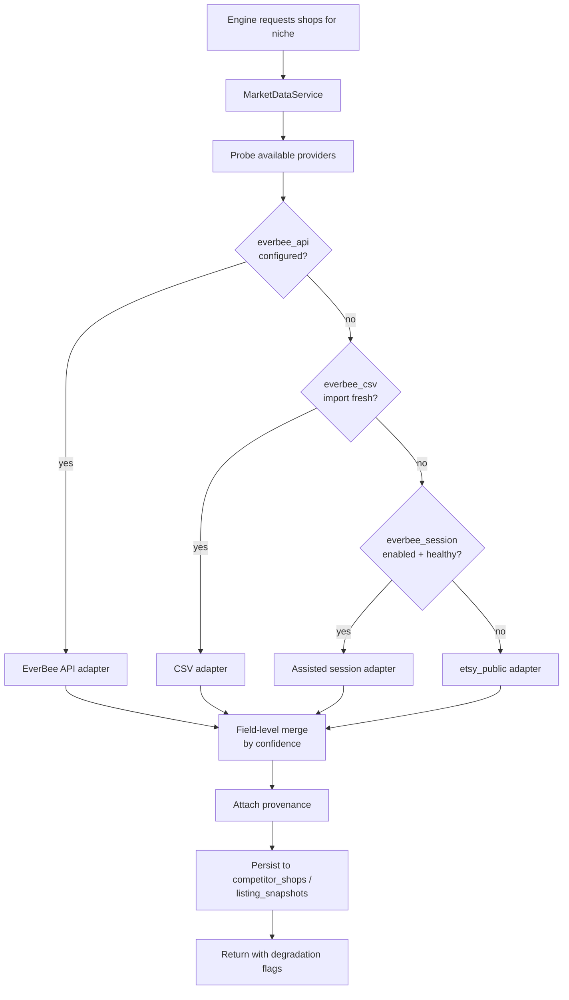

# 11 — EverBee / Market Data Integration Architecture

**Version:** 1.0

---

## 1. The honest starting position

**EverBee does not publish a documented, generally-available public API.** It is a subscription product delivered as a web application and a browser extension. Any architecture that hard-depends on a stable EverBee API is building on sand.

This is not a reason to avoid EverBee — its sales and revenue estimates are the single highest-value input to this system, and the operator already pays for it. It *is* a reason to build the integration as **a chain of interchangeable adapters behind one interface**, with a guaranteed path that cannot break.

**Design commitment ([ADR-0009](adr/ADR-0009-market-data-acquisition-posture.md)):**

> The system must remain fully functional — degraded in fidelity, not in capability — using only (a) Etsy's public API and (b) data the operator exports and imports themselves.

Everything above that baseline is an enhancement, gated by capability detection.

---

## 2. The `MarketDataProvider` interface

Every acquisition mechanism implements the same interface. Engines never know which one served them.

```ts
interface MarketDataProvider {
  readonly id: ProviderId              // 'everbee_csv' | 'everbee_session' | 'everbee_api'
                                       // | 'etsy_public' | 'manual_csv' | 'fixture'
  readonly capabilities: Capabilities
  readonly compliance: ComplianceProfile

  probe(): Promise<ProbeResult>                                   // is this provider usable now?
  searchShops(q: ShopQuery): Promise<Paged<ShopRecord>>
  getShop(shopRef: ShopRef): Promise<ShopRecord | null>
  listShopListings(shopRef: ShopRef, q: ListingQuery): Promise<Paged<ListingRecord>>
  searchListings(q: ListingQuery): Promise<Paged<ListingRecord>>
  getKeywordMetrics?(terms: string[]): Promise<KeywordMetric[]>
  getTrend?(term: string): Promise<TrendSeries>
}

type Capabilities = {
  shopSearch: boolean
  shopSalesEstimates: boolean
  shopRevenueEstimates: boolean
  listingSalesEstimates: boolean
  listingRevenueEstimates: boolean
  listingViews: boolean
  reviewVelocity: boolean
  keywordVolume: boolean
  trendSeries: boolean
  maxListingsPerShop: number
  freshnessHours: number
}

type ComplianceProfile = {
  tier: 'green' | 'amber' | 'red'
  basis: string                  // why this tier
  requiresOperatorConsent: boolean
  requiresOperatorCredentials: boolean
  documentedTermsReviewDate: string
}
```

**Every record carries provenance:**

```ts
type Provenance = {
  providerId: ProviderId
  fetchedAt: string
  confidence: 'low' | 'medium' | 'high'
  isEstimate: boolean
  fieldSources: Record<string, ProviderId>   // per-field, because records are merged
}
```

This is what makes the UI able to honestly say "price: measured, sales: estimated (medium confidence, from your EverBee export of 3 days ago)".

---

## 3. The adapter chain

The `MarketDataService` composes providers into a **resolution chain** per field group, taking the highest-confidence available value and recording what it used.



### 3.1 Adapter A — `everbee_csv` (**default, always available, compliance: green**)

The operator exports data from EverBee's own UI (a feature the product provides to its subscribers) and uploads the file. No automation touches EverBee's systems.

| Aspect | Detail |
|---|---|
| Trigger | Manual upload, or a watched folder / drag-drop in the Data settings page |
| Formats | EverBee shop export, EverBee listing/product export, EverBee keyword export; plus a generic mapping mode |
| Parsing | Header auto-detection with a fuzzy column mapper; the operator confirms or corrects the mapping once and it is remembered per file signature |
| Validation | Per-row Zod validation; rejected rows reported with the reason and downloadable |
| Freshness | `fetchedAt` = export date if present in the file, else upload time; the UI warns when data is > 14 days old |
| Confidence | `medium` for estimates, `high` for directly observed fields |
| Capabilities | shop + listing sales/revenue estimates, review counts, keyword volume — i.e. everything that matters |
| Failure mode | None that can be caused externally. This path breaks only if the operator stops exporting. |

**Because this path is the default, the system's core value is never hostage to a scraping arms race.**

### 3.2 Adapter B — `everbee_api` (compliance: green, if it exists)

If EverBee offers an API (now or later — including partner/affiliate programmes), this adapter is a thin, documented HTTP client with the standard adapter contract (auth, retry, rate limit, breaker, fixtures). It is written to be trivially added; it is not assumed to exist.

**Engineering action:** before Phase 2, contact EverBee to request API/partner access and record the outcome in this document. A signed data agreement converts the highest-value input from `amber` to `green` permanently, and is worth pursuing commercially.

### 3.3 Adapter C — `everbee_session` (compliance: amber, opt-in, off by default)

An operator-authorised, operator-credentialed, low-rate mechanism that uses the operator's own logged-in session to retrieve data they can already see in the UI.

| Guardrail | Rule |
|---|---|
| Off by default | Requires explicit enablement with a consent screen naming the risk |
| Operator's own credentials only | Never a shared or system account |
| Rate | ≤ 1 request per 3 seconds, ≤ 500 requests/day, randomised jitter, no parallelism |
| Respect | Honours `robots.txt` and any `Retry-After`; halts immediately on 403/429 and opens the breaker for 24 h |
| Scope | Only data the authenticated operator is entitled to see under their subscription |
| Transparency | Every request logged in `provider_calls`; a live counter shown in settings |
| Kill switch | One toggle disables it; the system falls back to CSV/Etsy without interruption |
| Legal review | Terms reviewed at each phase gate; date recorded in `ComplianceProfile.documentedTermsReviewDate` |

**Explicitly not built:** headless-browser fingerprint evasion, CAPTCHA solving, IP rotation, or any technique whose purpose is to avoid detection. If access requires evasion, the correct engineering answer is that the adapter is unavailable. This is recorded as a hard product constraint, not a preference.

### 3.4 Adapter D — `etsy_public` (compliance: green, always available)

Etsy's Open API v3 provides *measured* data — real prices, real listing metadata, real review counts, real shop ages — but **not** sales or revenue estimates.

| Field | Available | Confidence |
|---|---|---|
| Listing title, description, tags, materials, price, images, taxonomy | ✅ | high |
| Listing creation date, state, views (own shop only), favourites | ✅ / partial | high |
| Shop name, open date, review count, average rating | ✅ | high |
| Shop total sales | ✅ (public sales count) | high |
| Per-listing sales estimate | ❌ | — |
| Per-listing revenue estimate | ❌ | — |
| Keyword search volume | ❌ | — |

**Derived proxies when this is the only source** (all clearly labelled `estimated`, `low` confidence, with the method named in the UI):

| Missing metric | Proxy |
|---|---|
| Listing sales | Review count × niche-calibrated review-to-sale ratio (default 1:22, configurable, refined from the operator's own listings once outcome data exists), scaled by listing age |
| Listing revenue | Proxy sales × price |
| Review velocity | Reviews in trailing 90 days, from repeated snapshots (requires ≥ 2 captures — hence the snapshot design) |
| Demand index | Composite of shop-level sales, review velocity, and result-count-to-engagement ratio |
| Trend | Trailing change in review velocity across snapshots |

This is materially weaker than EverBee data. The product says so, plainly, in the degradation banner — and it still produces a usable opportunity report, competitor analysis and style analysis, because **the style, layout, pricing and SEO analysis — which is the genuinely differentiated part — depends only on data Etsy provides.**

### 3.5 Adapter E — `manual_csv` and `fixture`

`manual_csv` accepts a generic schema for data from any other tool (eRank, Alura, Sale Samurai, a spreadsheet). `fixture` serves recorded data for tests and local development, making the whole pipeline runnable offline.

---

## 4. Capability-driven degradation

The pipeline reads `capabilities` at run start and adapts, rather than failing.

| Missing capability | Effect | User-visible message |
|---|---|---|
| `listingSalesEstimates` | Cohorts built from proxy metric; confidence downgraded; factors requiring n are stricter | "Sales estimates unavailable — cohorts derived from review-based proxies. Import an EverBee export to improve accuracy." |
| `shopRevenueEstimates` | Shop selection uses sales + reviews + velocity only | Selection rationale shows which criteria were used |
| `keywordVolume` | SEO keyword ranking uses competitor-tag TF-IDF + sales weighting only | Keyword evidence panel shows the method |
| `trendSeries` | Trend sub-score uses review-velocity delta | Sub-score badged `proxy method: review velocity` |
| All EverBee capabilities | Run marked `degraded`; opportunity report labelled | Prominent banner with a one-click CSV import |

**Rule:** the run never fails because of a missing provider. It produces a smaller, honestly-labelled result.

---

## 5. Data model and merge semantics

Records from multiple providers describing the same shop/listing are merged **field by field**, never row-replaced.

```ts
function mergeField<T>(candidates: Array<{value: T, provenance: Provenance}>): FieldResult<T> {
  // 1. Prefer measured over estimated
  // 2. Then higher confidence
  // 3. Then fresher fetchedAt
  // 4. Ties broken by provider priority order
  // Always records the winning source in fieldSources
}
```

- Identity is keyed by `etsy_shop_id` / `etsy_listing_id` where available, falling back to normalised shop name + URL matching with a review queue for ambiguous matches.
- Every merge writes a new `listing_snapshots` row. Nothing is overwritten, so the provenance of any historical analysis is fully recoverable.
- Conflicting estimates from two providers (e.g. CSV says 240 monthly sales, proxy says 90) are both retained; the merge picks one and the disagreement is surfaced in the listing detail drawer.

---

## 6. Ingestion pipeline (CSV path, the primary one)

```mermaid
flowchart LR
    U[Operator uploads CSV] --> S[Store as asset + market_data_imports row]
    S --> D[Detect format by header signature]
    D --> M[Apply saved mapping or prompt operator]
    M --> P[Stream-parse rows]
    P --> V[Validate + normalise<br/>currency, dates, numbers]
    V --> R{Row valid?}
    R -->|no| REJ[Collect rejection with reason]
    R -->|yes| ID[Resolve shop/listing identity]
    ID --> UP[Upsert competitor_shops / competitor_listings]
    UP --> SNAP[Insert listing_snapshots with provenance]
    SNAP --> ASSET[Queue thumbnail fetch if URL present]
    REJ --> REP[Import report: accepted/rejected/errors]
    ASSET --> REP
```



**Performance:** streaming parse (no full-file buffering), batched inserts of 500 rows, 100k-row file processed in under 60 seconds. Files up to 50 MB accepted.

**Idempotency:** an identical file (by sha256) re-uploaded within 24 h is recognised and skipped with a message rather than duplicating snapshots.

---

## 7. Compliance posture

| Provider | Tier | Basis | Consent required | Enabled by default |
|---|---|---|---|---|
| `everbee_csv` | 🟢 green | Operator exports their own subscribed data via the vendor's own export feature; no automated access to vendor systems | No | **Yes** |
| `everbee_api` | 🟢 green | Documented API used under its terms | No | If configured |
| `etsy_public` | 🟢 green | Etsy Open API v3 under developer terms, authenticated, rate-limited | No | **Yes** |
| `manual_csv` | 🟢 green | Operator-supplied file | No | Yes |
| `everbee_session` | 🟠 amber | Automated access to a third-party web application using the operator's credentials; permissibility depends on that vendor's terms | **Yes, explicit** | **No** |
| Anything requiring evasion | 🔴 red | Not built | — | Never |

**Governing rules**
1. Vendor terms are reviewed at every phase gate; the review date is stored and shown in settings.
2. Amber adapters require a consent screen that states the risk in plain language and names the operator as the party bound by the vendor's terms.
3. No adapter may implement anti-detection behaviour. If access is technically blocked, the adapter reports unavailable.
4. Only public commercial data is collected. **No personal data of shop owners, buyers or reviewers is stored** — reviewer names and review text are never persisted, only counts and velocities (NFR-P1).
5. Collected data is used for statistical analysis. Competitor images are stored transiently for style extraction, retained 180 days, never used as generative input, and never redistributed.
6. A single settings toggle disables all amber adapters instantly.

---

## 8. Caching and refresh

| Data | TTL | Refresh trigger |
|---|---|---|
| Shop record | 14 days | New run touching that shop, or manual refresh |
| Listing snapshot | 14 days | Same |
| Thumbnail asset | Permanent until GC (180 days unreferenced) | Content hash — never re-downloaded |
| Style profile | Permanent per extractor version | Extractor version bump |
| Keyword metrics | 30 days | New run in the same niche |
| CSV import | Immutable | New upload |

**The 14-day reuse window is significant:** re-running a niche a week later costs a fraction of the first run because shops, listings and style profiles are all reused. This is a deliberate cost-architecture decision, not an accident of caching.

---

## 9. Testing strategy

| Test | Method |
|---|---|
| CSV parsing | 20 real-shaped fixture files including malformed, partial, wrong-encoding, and mixed-currency cases |
| Mapping inference | Property test: shuffled/renamed columns still map correctly or prompt cleanly |
| Merge semantics | Table-driven tests over every combination of provider confidence/freshness |
| Degradation | Run the full pipeline with each capability individually disabled; assert the run completes and the correct banner appears |
| Provider probe | Simulated unavailability, timeouts, partial capability |
| Compliance | A test asserts that no adapter code path contains browser-fingerprint or CAPTCHA-handling logic (lint rule + review checklist) |
| Volume | 100k-row import under 60 s; 3,000-listing run without memory growth |

---

## 10. Roadmap for this integration

| Phase | Action |
|---|---|
| Phase 1 | Interface, `fixture` + `manual_csv` + `etsy_public` adapters, merge engine, provenance model |
| Phase 2 | `everbee_csv` adapter with format detection and mapping UI; degradation banners; capability probing |
| Phase 2 | **Commercial:** approach EverBee for API/partner access; record outcome here |
| Phase 3 | `everbee_session` adapter behind consent, if and only if terms review supports it |
| Phase 5 | Proxy-model calibration: use the operator's own realised sales to fit the review-to-sale ratio per niche, materially improving the `etsy_public`-only path |
| Phase 6 | Additional providers (eRank, Alura) via `manual_csv` schemas or their APIs where documented |
