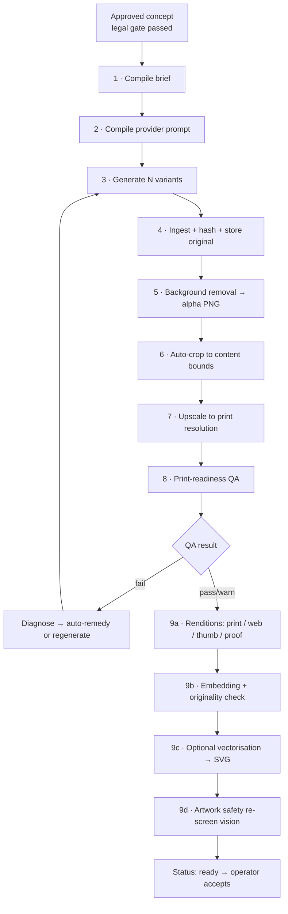

# 12 — Ideogram / Artwork Generation Architecture

**Version:** 1.0

---

## 1. Why Ideogram

Ideogram is the default image provider because POD artwork is disproportionately **typography-led**, and legible, well-composed text inside generated images is Ideogram's distinguishing strength. Vintage badge lockups, arched text, slogan tees and pun-driven mug designs all live or die on type rendering.

It is nonetheless **an implementation of an interface, not a dependency**. `ImageGenerationProvider` is the contract; Ideogram is the first implementation. Swapping or adding a provider is an adapter, not a refactor.

```ts
interface ImageGenerationProvider {
  readonly id: 'ideogram' | string
  readonly capabilities: {
    transparentBackground: boolean
    negativePrompt: boolean
    seedControl: boolean
    styleTypes: string[]
    aspectRatios: string[]
    maxResolution: { width: number; height: number }
    upscale: boolean
    typographyStrength: 'low' | 'medium' | 'high'
  }
  generate(req: GenerationRequest): Promise<GenerationResult>
  upscale?(req: UpscaleRequest): Promise<GenerationResult>
  describe?(imageRef: string): Promise<string>
}
```

---

## 2. The artwork pipeline

Generation is one stage of nine. Each stage is a separate job with its own retry policy, so a failure late in processing never discards a successful (paid-for) generation.



---

## 3. Stage 1 — The artwork brief

The brief is the contract between market intelligence and image generation. It is generated by the `reasoning` tier from **aggregate style statistics**, never from competitor imagery.

```ts
type ArtworkBrief = {
  subject: string                    // what the design depicts
  composition: string                // arrangement, focal hierarchy, negative space
  paletteHexes: string[]             // 3–6 explicit hex values
  paletteRationale: string           // which success factor produced this palette
  typographyDirection: {
    class: TypographyStyle           // controlled vocabulary, never a font file name
    weight: 'light'|'regular'|'bold'|'heavy'
    case: 'upper'|'title'|'lower'|'mixed'
    arrangement: 'straight'|'arched'|'stacked'|'circular'|'diagonal'
  } | null
  textContent: string | null         // exact words, if any
  textureFinish: string              // e.g. "subtle distressed grain, no photographic noise"
  backgroundRequirement: 'transparent'
  aspectRatio: string
  targetPrintPx: { width: number; height: number; dpi: 300 }
  negativeConstraints: string[]
  podNotes: string                   // garment-colour compatibility, ink coverage notes
}
```

**Standing negative constraints applied to every brief:**

```
no photorealistic human faces          no recognisable brand logos or wordmarks
no copyrighted characters              no sports team marks or insignia
no drop shadows on transparency        no gradients prone to banding at print size
no strokes thinner than 2px at target  no background colour or scene
no white halo at cutout edges          no watermarks or signatures
no small text below 24px at target     no more than 12 distinct colours (screen-print friendliness)
```

**Palette derivation is deterministic:** the success-weighted `palette_family` from Step 4 maps to a curated hex set per family, then is perturbed within the family's CIELAB bounds to keep designs from looking identical across concepts. The model receives the hexes; it does not choose them.

**The brief is editable by the operator before generation** and every edit creates a new version.

---

## 4. Stage 2 — Prompt compilation

The adapter — not the engine, and not the model — turns the brief into provider parameters. This keeps provider-specific tuning in one file.

```ts
function compilePrompt(brief: ArtworkBrief, style: DesignStyle): IdeogramRequest {
  return {
    prompt: renderTemplate(STYLE_TEMPLATES[style], brief),
    negative_prompt: [...brief.negativeConstraints, ...GLOBAL_NEGATIVES].join(', '),
    aspect_ratio: brief.aspectRatio,
    style_type: STYLE_TYPE_MAP[style],          // provider style preset
    magic_prompt_option: 'OFF',                 // we control the prompt; no silent rewriting
    seed: deterministicSeed(briefId, variantIndex),
    num_images: 1,                              // one call per variant → isolated failures
    // transparent background requested where supported; otherwise handled in stage 5
  }
}
```

**`magic_prompt_option: 'OFF'` is deliberate.** Provider-side prompt rewriting would break reproducibility, defeat the negative constraints, and make eval results meaningless.

**Style templates** (one per `design_style`, versioned like all prompts):

| Style | Template emphasis |
|---|---|
| `typography` | Lockup structure, letterform class, kerning/arrangement, badge or banner framing, flat vector aesthetic |
| `vintage` | Distressed texture at controlled opacity, limited retro palette, sun-fade weathering, 70s/retro type pairing |
| `hand_drawn` | Ink-line quality, imperfect stroke weight, sketch hatching, marker or brush texture |
| `illustration` | Flat vector shapes, defined outline weight, limited palette, clear silhouette at thumbnail size |
| `humour` | Legible punchline typography, simple supporting graphic, high contrast, reads in under a second |
| `modern` | Minimal geometry, generous negative space, restrained palette, single strong idea |

---

## 5. Stages 3–4 — Generation and ingestion

| Aspect | Rule |
|---|---|
| Variants | Default 4, range 1–8, each an independent API call so one failure costs one variant |
| Concurrency | Redis semaphore, default 4 in-flight per workspace |
| Seeds | Deterministic per `(briefId, variantIndex)` so regeneration with the same brief is reproducible, and an operator can request "same seed, tweaked brief" |
| Timeout | 120 s per generation, 1 retry with the same seed, then 1 retry with a new seed |
| Cost | Recorded per generation against the run budget before dispatch |
| Ingestion | Download → sha256 → dedupe against `assets` → store original immutably (never overwritten) |
| Provenance | `artworks` row stores prompt text, negative prompt, all parameters, seed, provider request id, cost, latency |

**Hard rule (FR-1027):** the generation adapter has **no code path that accepts an image as input** other than the artwork's own prior renditions for upscaling. Competitor imagery cannot reach the provider by construction, not by policy.

---

## 6. Stage 5 — Background removal

Print-on-demand requires true alpha transparency. Even when the provider returns a nominally transparent PNG, edges routinely carry a halo from the original background.

**Chain (first success wins, recorded per artwork):**
1. Provider-native transparent output, if the capability is present and the result passes the alpha check.
2. Local segmentation (`rembg`-class model running in the worker container) — no per-image cost, ~1.5 s.
3. Hosted removal service adapter — fallback for difficult cases, small per-image cost.

**Post-removal refinement (deterministic, `sharp` + custom kernels):**
- Alpha threshold cleanup: pixels with `0 < α < 12` → 0, removing dust.
- Halo decontamination: for pixels with `12 ≤ α ≤ 240`, un-multiply the background colour estimated from the original.
- Edge feather ≤ 1 px, no more (heavier feathering prints as a visible fringe).
- Connected-component removal of stray islands smaller than 0.05% of the content bounding box.

**Verification:** the result must have a genuine alpha channel, ≥ 3% fully transparent pixels (a fully opaque result means removal failed), and no more than 8% semi-transparent pixels (a high value indicates a soft-edged mess that will print badly).

---

## 7. Stages 6–7 — Crop and upscale

**Auto-crop:** compute the alpha bounding box, add configurable padding (default 2%), centre on the target canvas at the required aspect ratio. Records the crop rectangle so it is reversible.

**Upscale to print size:**

| Product | Print area | Required px @300 DPI |
|---|---|---|
| T-shirt / sweatshirt (DTG front) | 12"×16" typical, up to 15"×18" | 3600×4800 → 4500×5400 |
| Hoodie (front) | 12"×14" | 3600×4200 |
| Mug (11 oz wrap) | 8.5"×3.35" | 2550×1005 |
| Poster A2 | 16.5"×23.4" | 4960×7020 |
| Tote | 12"×14" | 3600×4200 |

**Method:** provider upscale where available and cost-effective; otherwise a local ESRGAN-class model in the worker; final resize via Lanczos in `sharp`. Never a naive bicubic stretch — it produces the soft, obviously-upscaled look that reads as low quality in print.

**Guard:** if the source resolution is so low that reaching target DPI requires more than 4× linear upscaling, QA fails with `insufficient_source_resolution` and the remedy is regeneration at a higher provider resolution, not further upscaling.

---

## 8. Stage 8 — Print-readiness QA

Deterministic, versioned, and blocking. An artwork that fails cannot be attached to a product draft (FR-1022, AC-1000).

| Criterion | Threshold | Severity | Remedy offered |
|---|---|---|---|
| Effective DPI at target print size | ≥ 300 | **fail** | Upscale |
| Alpha channel present | required | **fail** | Re-run background removal |
| Fully transparent pixel share | ≥ 3% | **fail** | Re-run background removal |
| Semi-transparent pixel share | ≤ 8% | warn | Edge refinement |
| Minimum stroke width at print size | ≥ 2 px | **fail** | Regenerate with a bolder-lineweight brief |
| Minimum text height at print size | ≥ 24 px | warn | Regenerate with fewer words |
| Distinct colour count | ≤ 12 preferred, ≤ 64 hard | warn / fail | Palette quantisation |
| Out-of-gamut colours for DTG | ≤ 5% | warn | Gamut-map to the printable set |
| Edge halo detection (mean chroma delta in the 2 px alpha border) | below threshold | warn | Decontamination pass |
| Near-white ink on white garment | flagged if > 10% of ink is `L* > 92` | warn | Recommend dark garment colours only |
| Canvas aspect vs target | exact match | **fail** | Auto-crop |
| File size | ≤ 40 MB (Printify limit headroom) | **fail** | Recompress / reduce dimensions |
| Content bounds fill | ≥ 35% of canvas | warn | Auto-crop with tighter padding |

Every result is stored in `artwork_qa_results` with the measured value, the threshold, and the remedy, so the UI can show a specific instruction rather than "QA failed".

---

## 9. Stage 9 — Renditions, originality, vectorisation, safety

### 9.1 Renditions

| Kind | Spec | Purpose |
|---|---|---|
| `print_png` | Full res, alpha, sRGB, no metadata | Printify upload |
| `web_png` | 1200 px longest edge, alpha | UI, previews |
| `thumb` | 400 px, alpha | Grids, cards |
| `proof` | Checkerboard-composited, 1200 px | Transparency verification for the operator |
| `svg` | Vector, when applicable | Scalability, screen-print workflows |

All renditions are `artwork_assets` rows with `derived_from` pointers, producing an inspectable lineage tree.

### 9.2 Originality check (FR-1026)

- A 512-dim visual embedding is computed for every accepted artwork.
- Cosine similarity is computed against (a) every competitor thumbnail embedding in the run and (b) every prior artwork embedding in the workspace, via pgvector HNSW.
- `originality_score = (1 − maxSimilarity) × 100`.
- Similarity > 0.94 against a competitor image → hard warning, side-by-side comparison shown, explicit acknowledgement required before acceptance, recorded in the audit log.
- Similarity > 0.97 against the workspace's own prior artwork → flagged as a near-duplicate of an existing design, since self-cannibalisation is a real commercial problem.

### 9.3 Vectorisation (FR-1024)

Applied to typography-led and flat-illustration outputs, skipped with a stated reason for textured or photographic ones.

**Chain:** palette quantisation (k-means to ≤ 12 colours) → alpha-aware raster-to-vector trace (VTracer-class) → path simplification with a tolerance tuned to preserve letterforms → SVG emit with named colour groups. Output is validated by rasterising the SVG at print size and asserting a perceptual difference (SSIM) above 0.93 versus the source; below that, vectorisation is discarded and `svg_ready` stays false.

### 9.4 Artwork safety re-screen (FR-908)

A vision call checks the *rendered* artwork for what the brief could not guarantee: unintended brand logos, recognisable characters or likenesses, text that was not in the approved brief (image models frequently invent words), and inappropriate content. Any finding raises the artwork's risk level and routes it back through the Legal Engine's rule table.

---

## 10. Cost model

| Item | Unit cost (indicative) | Notes |
|---|---|---|
| Ideogram generation | ~£0.06 / image | Dominant cost |
| Background removal (local) | ~£0.001 | Worker CPU |
| Background removal (hosted fallback) | ~£0.02 | Rare |
| Upscale (local) | ~£0.003 | Worker CPU/GPU-less |
| Vectorisation | ~£0.002 | Worker CPU |
| Vision safety screen | ~£0.008 | Batched |
| Storage per artwork (all renditions) | ~£0.0004 / month | ~28 MB |

**Per accepted design:** 4 variants × £0.06 = £0.24, plus processing ≈ £0.02, plus an expected 0.6 regeneration cycles ≈ £0.16 → **≈ £0.42**, within the £0.60 budget (NFR §4).

**Cost controls:** generation only after concept selection and legal clearance; variant count defaults to 4 not 8; regeneration limits (2 automatic, then operator confirmation); a per-run artwork sub-budget; and QA before further processing so no money is spent post-processing a doomed image.

---

## 11. Failure handling

| Failure | Behaviour |
|---|---|
| Provider 5xx / timeout | Retry same seed once, then new seed once, then variant marked `failed` — siblings unaffected |
| Provider content refusal | Recorded with the reason; the brief is flagged for revision; treated as a signal, not retried blindly |
| All variants fail QA | Diagnostic summary naming the dominant failing criterion; suggested brief amendments; operator decides whether to regenerate |
| Background removal produces fully opaque output | Automatic fallback to the next removal method; if all fail, `qa_failed` with a specific message |
| Upscale ratio exceeds 4× | QA fails with `insufficient_source_resolution`; remedy is regeneration, not upscaling |
| Vectorisation SSIM below threshold | Silently skipped, `svg_ready = false`, reason recorded |
| Originality above threshold | Blocks acceptance until acknowledged; never auto-accepted |
| Provider outage | Circuit breaker opens; artwork step → `blocked_external`; concept stays queued and resumes automatically when the breaker closes |

---

## 12. Testing

| Test | Method |
|---|---|
| Prompt compilation | Snapshot tests per style template and brief permutation |
| Adapter | Fixture-backed; CI never calls the live API |
| Background removal | 30 reference images with hand-made alpha masks; assert IoU ≥ 0.95 |
| QA criteria | Synthetic images engineered to fail each criterion individually; assert exactly the expected criterion fails |
| Upscale | Assert output dimensions and DPI for every product type |
| Vectorisation | SSIM assertion against known-good sources |
| Originality | Known near-duplicate pairs must exceed the threshold; known-distinct pairs must not |
| Legal gate | Assert `generate` throws `LEGAL_GATE_NOT_PASSED` and makes zero provider calls for an unscreened concept |
| Cost | Assert a 4-variant generation with one retry stays within the sub-budget |
| Determinism | Same brief + same seed → identical stored parameters and prompt text |

---

## 13. Provider portability

If Ideogram becomes unsuitable (pricing, quality, availability, terms), the swap is:

1. Implement `ImageGenerationProvider` in `packages/adapters/<newprovider>`.
2. Add style-template mappings for the six styles.
3. Run the artwork eval suite; compare typography legibility and QA pass rate side by side.
4. Flip a config value.

Stages 4–9 (ingestion, removal, crop, upscale, QA, renditions, originality, vectorisation, safety) are provider-agnostic and unchanged. **That is roughly 80% of the artwork pipeline's value, and it is ours.**
