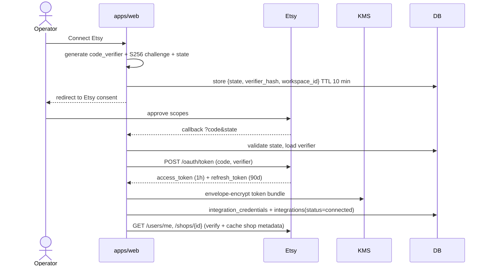
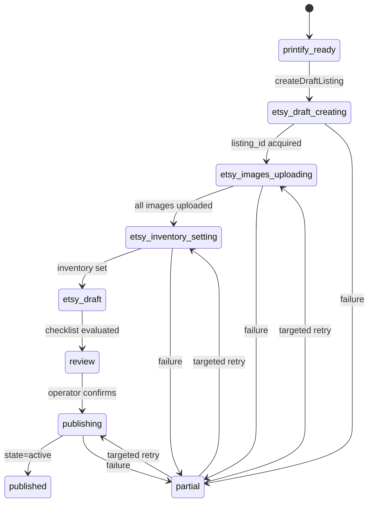

# 13 — Etsy Integration Architecture

**Version:** 1.0 · Target: **Etsy Open API v3**

---

## 1. Role of Etsy in the system

Etsy is used for three distinct purposes, with different trust and rate characteristics:

| Purpose | Direction | Data |
|---|---|---|
| **Market observation** | Read | Public shop and listing metadata for competitor analysis (measured facts — price, tags, images, ages, review counts) |
| **Publishing** | Write | Draft listing creation, image upload, inventory, and the explicit publish transition |
| **Performance tracking** | Read | Own-shop listing stats: views, favourites, orders, revenue, state |

Only the operator's own shop is written to. Competitor data is read-only and is never modified, messaged, or interacted with.

---

## 2. Authentication

**OAuth 2.0 Authorization Code with PKCE.** Etsy v3 requires PKCE; there is no client-secret-only flow for this use case.

### 2.1 Scopes requested (least privilege)

| Scope | Why |
|---|---|
| `listings_r` | Read own listings for sync and drift detection |
| `listings_w` | Create and update draft listings |
| `listings_d` | Delete a draft the system created in error |
| `shops_r` | Shop metadata, shipping profiles, sections |
| `shops_w` | Shipping profile association (only if required by the flow) |
| `transactions_r` | Order and revenue data for performance tracking |

**Not requested:** `email_r`, `profile_r`, `favorites_*`, `feedback_r`, `cart_*`, `billing_r`, `recommend_*`. Requesting less is both a security posture and a trust signal.

### 2.2 Token lifecycle

| Concern | Handling |
|---|---|
| Storage | Envelope-encrypted (AES-256-GCM, per-workspace DEK wrapped by a KMS master key). Never returned to the client, never logged. |
| Refresh | Proactive, at 80% of access-token lifetime, by a scheduled job. A distributed lock prevents concurrent refresh from racing and invalidating the refresh token. |
| Refresh-token rotation | Etsy rotates on refresh; the new pair is written in the same transaction that marks the old one superseded. If the write fails after a successful refresh, the reconciliation job re-authenticates rather than looping. |
| Expiry (90 days idle) | A weekly job warns at 14 days remaining and at 3 days; the UI shows a countdown when < 14 days. |
| Revocation | Any 401 with an auth error code sets `integrations.status = needs_reauth`, pauses all publish jobs for the workspace into `needs_reauth` (resumable, not failed), and raises a critical notification. |
| Disconnect | Revokes at Etsy where supported, deletes credentials, retains listings and their history. |

---

## 3. Rate limiting

Etsy's documented limits: **10 requests/second** and **10,000 requests/day** per app, with per-endpoint variation.

| Control | Implementation |
|---|---|
| Token bucket | Redis-backed, shared across all processes, keyed `etsy:{workspaceId}`, refill 10/s, burst 10 |
| Daily budget | Counter with a UTC-midnight reset, tracked in `integrations.quota_used` |
| **Reserved quota** | 15% of the daily budget (1,500 requests) is reserved for publishing and performance sync. Research/observation calls are rejected once the unreserved 85% is spent, so a heavy research day can never make publishing impossible. |
| Priority classes | `publish` > `sync` > `research`. The limiter serves higher classes first when contended. |
| 429 handling | Honour `Retry-After`; exponential backoff with jitter; three consecutive 429s open the circuit breaker for 60 s |
| Batch preference | Use bulk endpoints (`getListingsByShop` with pagination) over per-id fetches wherever available |
| Conditional requests | ETag/`If-None-Match` where supported, so unchanged listings cost a 304 rather than a payload |

**Budget arithmetic for a standard run:** 10 shops × (1 shop call + ~4 paginated listing pages) ≈ 50 calls, plus ~120 image fetches (image bytes come from CDN URLs, not the API, so they do not consume quota). Research is therefore cheap in quota terms; the daily limit is not a practical constraint at Phase-1 volumes but becomes one in SaaS Stage 3 (see doc 16 §7).

---

## 4. Publishing flow

Decomposed into independently idempotent operations recorded in `publish_jobs`, because a monolithic "publish" that fails halfway is unrecoverable without duplicates.

### 4.1 Operation: create draft listing

`POST /v3/application/shops/{shop_id}/listings`

| Field | Source |
|---|---|
| `title` | Selected `seo_variations.title` (≤ 140 chars, validated) |
| `description` | Selected variation's structured description |
| `price` | `product_drafts.retail_price_amount` (default variant) |
| `quantity` | Workspace default (999 for POD) |
| `taxonomy_id` | From `product_types` / SEO suggestion, operator-confirmable |
| `tags` | Exactly 13, each ≤ 20 chars, validated pre-flight |
| `materials` | From the SEO variation |
| `who_made` | `i_did` (POD with own design) — configurable |
| `when_made` | `made_to_order` |
| `is_supply` | `false` |
| `shipping_profile_id` | Workspace default or per-product-type mapping |
| `return_policy_id` | Workspace default |
| `shop_section_id` | Optional, from workspace mapping |
| `production_partner_ids` | Printify provider, mapped to the operator's registered production partner |
| `is_personalizable`, `personalization_*` | From the concept if it is a personalisation play |
| **`state`** | **`draft` — always** |

**Hard rule (FR-1402):** the create call never sets `state: active`. Publishing is a separate, separately-authorised update.

### 4.2 Operation: upload images

`POST /v3/application/shops/{shop_id}/listings/{listing_id}/images`

- Source: Printify mockups (primary) plus optionally the artwork proof and a size chart.
- Up to 10 images, uploaded sequentially in the operator-defined order with explicit `rank`; the primary image is rank 1.
- Each upload is a separate `publish_jobs` row keyed by `sha256(listingId:assetId:rank)` so a partial failure retries only the missing images.
- Etsy requires images ≥ 2000 px on the shortest side for best quality; the adapter validates and upscales the mockup if needed before upload.
- Failures are per-image; the draft is usable with the images that succeeded and shows exactly which are missing.

### 4.3 Operation: inventory and variants

`PUT /v3/application/listings/{listing_id}/inventory`

- Builds the full inventory payload: products (variant combinations), property values (size, colour), per-variant price, quantity, SKU.
- SKU convention: `{draftShortId}-{blueprintId}-{variantId}` — stable, mappable back to the Printify variant for order reconciliation.
- Etsy's inventory endpoint is a full replace, not a patch: the adapter always sends the complete set, and the operation is idempotent by construction.
- Variant count caps and property-value limits are validated before the call, with field-mapped errors.

### 4.4 Operation: publish

`PATCH /v3/application/shops/{shop_id}/listings/{listing_id}` with `state: active`.

Pre-flight, server-side (never trusting the client's disabled button):
1. Re-evaluate every hard checklist item.
2. Re-verify the legal screening status of concept, artwork and listing text.
3. Re-verify margin ≥ floor at the current price.
4. Confirm the listing still exists and is still `draft`.
5. Confirm quota headroom in the reserved publish allocation.

Then: publish → record `listings` row transition → write `audit_log` with the full payload → schedule the first performance sync at T+24 h → notify.

---

## 5. Reading competitor data

| Endpoint | Use |
|---|---|
| `GET /v3/application/listings/active` | Keyword/taxonomy-based discovery of active listings |
| `GET /v3/application/shops` | Shop lookup by name |
| `GET /v3/application/shops/{shop_id}` | Shop metadata: open date, sales count, review count, rating |
| `GET /v3/application/shops/{shop_id}/listings/active` | A shop's active listings, paginated |
| `GET /v3/application/listings/batch` | Batched listing detail |
| `GET /v3/application/listings/{id}/images` | Image URLs for style extraction |
| `GET /v3/application/seller-taxonomy/nodes` | Taxonomy tree, cached 24 h |

**Constraints and how they are handled**

| Constraint | Handling |
|---|---|
| No sales or revenue estimates in the API | Supplied by the market data provider chain (doc 11), or proxied from review counts with explicit low confidence |
| Views/favourites only for own shop | Competitor engagement is proxied by review velocity across snapshots |
| Pagination limit 100/page | Adapter paginates transparently with a hard cap per shop |
| Images served from CDN, not the API | Fetched directly, hashed, deduped; does not consume API quota |
| Public data only | Nothing beyond public listing/shop data is requested or stored (NFR-P1) |

---

## 6. Performance sync

**Schedule:** daily per published listing, staggered across the day to smooth quota use; more frequent (6-hourly) for the first 7 days after publish, when the signal is most decision-relevant.

| Metric | Source |
|---|---|
| Views, favourites | `GET /v3/application/shops/{shop_id}/listings/{listing_id}` and shop stats endpoints |
| Orders, revenue | `GET /v3/application/shops/{shop_id}/receipts` filtered to the listing, or transactions endpoint |
| State | Listing detail — detects deactivation, sell-out, expiry, removal |
| Price drift | Compared against the local record; divergence flags a manual edit made in Etsy's UI |

Each sync writes an immutable `performance_snapshots` row, computes deltas against the previous snapshot, and updates derived fields on `listings` (`first_sale_at`, `state`, `last_synced_at`).

**Drift detection:** if a listing's title, tags or price differ from the local record, the system records the drift and surfaces it rather than overwriting either side — the operator decides which is authoritative.

---

## 7. Error mapping

Every Etsy error is mapped to an `ApiError` with a field pointer where possible, so the UI can highlight the offending input.

| Etsy condition | Mapped code | UI behaviour |
|---|---|---|
| 400 invalid tag length | `VALIDATION_ERROR` + `field: tags[n]` | Highlight the tag chip, show the limit |
| 400 title too long / invalid characters | `VALIDATION_ERROR` + `field: title` | Inline counter turns red |
| 400 taxonomy invalid | `VALIDATION_ERROR` + `field: taxonomy_id` | Reopen the taxonomy selector |
| 400 missing shipping profile | `VALIDATION_ERROR` + `field: shipping_profile_id` | Link to settings |
| 401 / invalid token | `NEEDS_REAUTH` | Reconnect banner; jobs pause, not fail |
| 403 insufficient scope | `FORBIDDEN` | Explain which scope is missing and offer re-consent |
| 404 listing not found | `NOT_FOUND` | Mark local record as orphaned, offer resync |
| 409 conflict | `CONFLICT` | Show current remote state and offer merge |
| 429 | `RATE_LIMITED` + `retryAfterSeconds` | Automatic backoff, progress message |
| 5xx | `PROVIDER_ERROR`, retriable | Automatic retry, then breaker |

Raw Etsy messages are logged but never surfaced as the primary user-facing message.

---

## 8. Idempotency and duplicate prevention

Etsy has no idempotency-key header, so duplicate prevention is our responsibility.

| Guard | Mechanism |
|---|---|
| Application-level key | `publish_jobs.idempotency_key = sha256(draftId:operation:inputHash)`, unique per workspace |
| Pre-flight existence check | Before creating a listing, query by the draft's stored `etsy_listing_id`; if present, skip creation and continue the chain |
| Reconciliation | If a create call times out with an unknown outcome, a reconciliation job searches the shop's recent drafts for a matching title + SKU within a 10-minute window and adopts it rather than creating a second |
| Local uniqueness | `listings (workspace_id, etsy_listing_id)` unique index |
| UI | Publish button disables on submit; server re-checks state regardless |

**Requirement (NFR §2):** zero duplicate listings, ever. This is the single most operationally damaging failure the system could cause, and it is defended at four layers.

---

## 9. Etsy policy compliance

| Policy area | Our handling |
|---|---|
| **Handmade/POD disclosure** | `who_made`, `when_made`, `is_supply` set correctly; production partner declared on every listing |
| **Production partners** | The operator's Printify provider must be registered as a production partner in their Etsy account; the system validates this at connection time and blocks publishing with a clear message if absent |
| **Intellectual property** | Legal & Safety Engine screens concepts, artwork and listing text before publish (doc 15 §9, FR-900) |
| **Prohibited items** | Etsy's restricted-term list is checked in the SEO engine and again pre-publish |
| **Tag/title rules** | Hard validators; no keyword stuffing (repeat-ratio check), no misleading claims |
| **AI-generated content** | Etsy's policies on AI-assisted work evolve; the system stores the full provenance of every design (prompt, model, brief, human edits) so the operator can answer any disclosure requirement. A workspace setting controls whether AI assistance is disclosed in the description. |
| **No automation of prohibited actions** | The system never messages buyers, never manipulates reviews, never interacts with competitor listings, and never auto-publishes without human confirmation |
| **API terms** | Rate limits respected with headroom; data cached rather than re-fetched; no redistribution of Etsy data |

---

## 10. Testing

| Layer | Approach |
|---|---|
| Adapter unit | Zod schemas against 40+ recorded response fixtures, including every documented error shape |
| OAuth | Full PKCE flow against a mock authorisation server; state/verifier tampering must be rejected |
| Rate limiter | Concurrency test asserting ≤ 10 req/s across 8 simulated processes |
| Reserved quota | Assert research calls are refused once the unreserved budget is spent while publish calls still succeed |
| Idempotency | Simulate timeout-after-success on create; assert reconciliation adopts the existing listing and creates nothing new |
| Partial failure | Fail image 3 of 5; assert targeted retry uploads only images 3–5 |
| Publish gate | Assert publish is refused server-side when any hard checklist item fails, even if the request claims otherwise |
| Token expiry | Simulate 401 mid-publish; assert the job moves to `needs_reauth` and resumes cleanly after reconnection |
| E2E | Full draft creation against a mock Etsy in CI; against a real sandbox shop before each release |

---

## 11. Future extensions

| Capability | Phase | Notes |
|---|---|---|
| Listing updates / SEO A/B testing | 5 | Update a live listing's title/tags from a stored variation and measure the delta — the natural evolution of the SEO engine |
| Bulk publishing | 5 | Queue-driven with per-item checklists and one confirmation per batch |
| Etsy Ads integration | Post-launch | Read-only spend/ROAS attribution first; management only if the API supports it |
| Multiple shops per workspace | 6 (SaaS) | The schema already supports it — `integrations` is per-workspace-per-provider and would become per-shop |
| Marketplace abstraction | 6+ | `Marketplace` interface with Etsy as the first implementation, opening Amazon Merch / Shopify without touching the pipeline |
