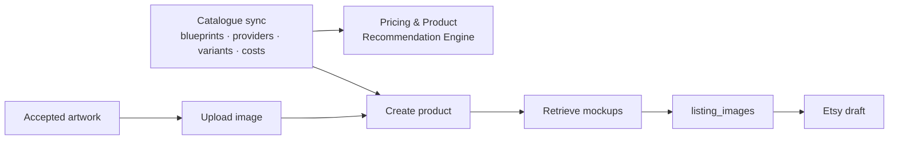

# 14 — Printify Integration Architecture

**Version:** 1.0 · Target: **Printify API v1**

---

## 1. Role of Printify

Printify is the production layer. It supplies three things the system cannot compute for itself:

1. **The product catalogue** — blueprints (garment/product models), print providers, variants, print areas, and **true production costs**, which are the foundation of every profitability calculation.
2. **Product assembly** — placing artwork on a blueprint with a defined print area, position and scale.
3. **Mockups** — the listing images that carry most of the conversion weight on Etsy.



---

## 2. Authentication and account model

| Aspect | Detail |
|---|---|
| Auth | Personal Access Token (bearer), generated by the operator in Printify |
| Storage | Envelope-encrypted like all credentials; masked in the UI; never sent to the client |
| Validation | On connect: `GET /v1/shops.json` — confirms the token and enumerates connected shops |
| Shop selection | The operator picks the Printify shop that corresponds to their Etsy shop; stored on `integrations.external_shop_id` |
| Rotation | Manual (Printify tokens are long-lived); the UI shows the last successful call and warns after 30 days of silence |
| Scope | Printify tokens are account-wide; this is a known limitation and is mitigated by using a dedicated token for this application and documenting it in the security model |

---

## 3. Catalogue synchronisation

The catalogue is large (hundreds of blueprints, thousands of variants) and changes slowly. It is synced into local tables so that pricing, recommendation and validation are fast local operations rather than API calls.

| Sync | Frequency | Endpoint | Target table |
|---|---|---|---|
| Blueprints | Weekly + on demand | `GET /v1/catalog/blueprints.json` | `blueprints` |
| Print providers per blueprint | Weekly | `GET /v1/catalog/blueprints/{id}/print_providers.json` | `print_providers` |
| Variants + costs | **Daily** | `GET /v1/catalog/blueprints/{id}/print_providers/{pid}/variants.json` | `blueprint_variants` |
| Shipping costs | Weekly | `GET /v1/catalog/blueprints/{id}/print_providers/{pid}/shipping.json` | `blueprint_variants.shipping_*` |

**Why variants sync daily:** production costs move, and a stale cost silently corrupts every margin calculation and every profitability score. A cost change of more than 5% on any variant referenced by an unpublished draft raises a notification and re-runs that draft's pricing.

**Scope control:** only blueprints mapped to supported `product_types` and to the workspace's whitelisted print providers are synced in full. This keeps the sync to a few hundred requests rather than tens of thousands.

**Provider reliability rating:** maintained locally from observed production times, error rates and (once orders exist) reprint/complaint rates. It feeds the product recommendation ranking, because a cheap provider with poor reliability is not actually cheap.

---

## 4. Product creation flow

### 4.1 Operation: upload artwork

`POST /v1/uploads/images.json`

| Aspect | Detail |
|---|---|
| Input | The `print_png` rendition (full resolution, alpha, sRGB) |
| Method | URL-based upload preferred (a short-lived signed URL to our object storage) to avoid large base64 payloads |
| Deduplication | `artworks`/`assets` store the returned Printify image id keyed by content sha256; the same artwork is never uploaded twice, even across drafts |
| Validation before upload | QA must have passed; dimensions and file size checked against Printify limits |
| Failure | Mapped errors for "image too small", "unsupported format", "file too large", each with a specific remedy |

### 4.2 Operation: create product

`POST /v1/shops/{shop_id}/products.json`

```jsonc
{
  "title": "…",                 // from the selected SEO variation
  "description": "…",
  "blueprint_id": 6,
  "print_provider_id": 29,
  "variants": [
    { "id": 17887, "price": 2295, "is_enabled": true },   // minor units
    { "id": 17888, "price": 2295, "is_enabled": true }
  ],
  "print_areas": [
    {
      "variant_ids": [17887, 17888],
      "placeholders": [
        { "position": "front",
          "images": [ { "id": "<printify_image_id>",
                        "x": 0.5, "y": 0.42, "scale": 0.92, "angle": 0 } ] }
      ]
    }
  ]
}
```

**Placement calculation is deterministic and product-type-aware**, computed in `packages/domain/placement`:

| Product | Default placement |
|---|---|
| T-shirt / sweatshirt front | Centred horizontally; top of design ~2.5" below collar → `y ≈ 0.42`; scale to fill 92% of print-area width or 100% of height, whichever binds first |
| Hoodie front | Adjusted for the pocket: `y ≈ 0.38`, max height reduced |
| Mug wrap | Centred, scale to 88% of the wrap height, with safe margins at the handle seams |
| Poster | Full-bleed to the print area with a configurable border |
| Tote | Centred, `y ≈ 0.45` |

The operator can adjust position, scale and rotation in the Printify tab with a live preview; changes are persisted on `product_drafts.placement` and re-applied on any product update.

### 4.3 Operation: mockups

Mockups are generated asynchronously by Printify after product creation.

| Aspect | Detail |
|---|---|
| Retrieval | `GET /v1/shops/{shop_id}/products/{product_id}.json` returns `images[]` once ready |
| Waiting strategy | Webhook if configured, otherwise polling with backoff: 5 s, 10 s, 20 s, 40 s, 60 s, then every 60 s to a 10-minute ceiling |
| Never blocking | Polling happens in the `publish` queue; no request thread ever waits |
| Selection | Camera/position variants are filtered to a configured preferred set (front flat, front model, lifestyle, close-up detail) rather than importing all 20+ |
| Storage | Downloaded, hashed, stored as `assets`, linked as `listing_images` with `source = printify_mockup` |
| Ordering | Default order derived from the success analysis (which mockup styles correlate with sales in this niche); operator can drag to reorder |
| Quality gate | Mockups below 2000 px on the shortest side are upscaled before Etsy upload |

### 4.4 Operation: update product

Editing a draft after creation (price change, variant change, placement change) issues `PUT /v1/shops/{shop_id}/products/{product_id}.json` rather than creating a new product. `product_drafts.printify_product_id` guarantees this; the system never creates a second Printify product for the same draft.

---

## 5. Publishing bridge: two modes

Printify can push products to a connected Etsy shop itself. We support both routes, defaulting to direct Etsy control.

| | **Mode A — Direct Etsy (default)** | **Mode B — Printify bridge** |
|---|---|---|
| How | Product built in Printify; mockups pulled locally; the Etsy listing is created by our Etsy adapter | `POST /v1/shops/{shop_id}/products/{id}/publish.json` and Printify creates the Etsy listing |
| SEO control | **Full** — our 13 tags, our title, our structured description, our taxonomy, our image order | Limited — Printify's mapping governs; tags and description control is weaker |
| Variant/price control | Full | Good |
| Image order | Full | Partial |
| Draft-only guarantee | Yes — we control `state` | Depends on Printify's publish behaviour and shop settings |
| Failure isolation | Per-operation retry | Opaque; the whole publish succeeds or fails |
| **Verdict** | **Default.** SEO is the product's core value; ceding control of it is unacceptable. | Available as a fallback when the operator's Etsy API access is unavailable. |

In Mode A, after our Etsy listing exists, we call Printify's "set published" / external-id endpoint so Printify associates its product with the Etsy listing for order routing. This step is mandatory — without it, orders will not fulfil. It is a checklist item on the Final Review page.

---

## 6. Rate limiting and reliability

| Control | Setting |
|---|---|
| Rate limiter | Redis token bucket keyed `printify:{workspaceId}`, conservative default of 60 req/min with adaptive reduction on 429 |
| Catalogue sync | Runs in the `sync` queue at low priority, with a separate, lower rate ceiling so it can never crowd out publishing |
| Retries | Idempotent GETs: 3 attempts with backoff. POST create: 1 attempt, then reconciliation (see §7) |
| Circuit breaker | 5 consecutive failures or >50% error rate over 20 calls → open 60 s, exponential to 15 min |
| Timeouts | 15 s standard, 60 s for uploads |
| Webhooks | `product:publish:started`, `product:publish:succeeded`, `product:publish:failed`, `order:*` — HMAC-verified, persisted then queued (doc 8 §7.1) |

---

## 7. Idempotency and reconciliation

Printify's create endpoint has no idempotency key, so the same defences as Etsy apply:

| Guard | Mechanism |
|---|---|
| Application key | `publish_jobs.idempotency_key = sha256(draftId:'printify_create':inputHash)` |
| Pre-flight | If `product_drafts.printify_product_id` is set, skip creation |
| Reconciliation | On an ambiguous timeout, list the shop's recent products and match by title + blueprint + variant signature within a 10-minute window; adopt rather than recreate |
| Image dedupe | By content hash before every upload |
| Local uniqueness | One Printify product per draft, enforced by the column and a service-layer assertion |

---

## 8. Error mapping

| Printify condition | Mapped code | Remedy shown |
|---|---|---|
| Image resolution too low for the print area | `VALIDATION_ERROR` | "Upscale the artwork" with a one-click action |
| Unsupported image format | `VALIDATION_ERROR` | Regenerate the `print_png` rendition |
| Variant unavailable / discontinued | `CONFLICT` | Re-select variants; the catalogue is resynced automatically |
| Blueprint/provider mismatch | `VALIDATION_ERROR` | Reopen the configuration table with valid combinations only |
| Print area placement out of bounds | `VALIDATION_ERROR` | Reset placement to the computed default |
| Shop not connected to a marketplace | `INTEGRATION_NOT_CONNECTED` | Link to Printify's shop settings |
| 401 | `NEEDS_REAUTH` | Reconnect with a new token |
| 429 | `RATE_LIMITED` | Automatic backoff |
| 5xx | `PROVIDER_ERROR` | Automatic retry, then breaker |

---

## 9. Cost model and its role in pricing

The Printify catalogue is the authoritative source of production cost, and it is the input on which the entire profitability sub-score and margin floor depend.

```
unit_cost      = variant.cost + (free_shipping ? shipping.first_item : 0)
gross_revenue  = retail_price
etsy_fees      = listing_fee
               + retail_price × transaction_pct
               + retail_price × payment_pct + payment_fixed
               + (offsite_ads_applies ? retail_price × offsite_ads_pct : 0)
               + retail_price × regulatory_pct
vat            = vat_applies ? retail_price × vat_pct / (1 + vat_pct) : 0
net_profit     = gross_revenue − unit_cost − etsy_fees − vat
margin_pct     = net_profit / gross_revenue
```

**Worked example (illustrative, GBP):**

| Line | Amount |
|---|---|
| Retail price | £22.95 |
| Printify unit cost (Gildan 5000, EU provider) | −£7.42 |
| Shipping (absorbed for free shipping) | −£4.10 |
| Etsy listing fee | −£0.16 |
| Transaction fee 6.5% | −£1.49 |
| Payment processing 4% + £0.20 | −£1.12 |
| Regulatory operating fee 0.32% | −£0.07 |
| **Net profit (no offsite ads)** | **£8.59 — 37.4% margin** |
| Offsite ads worst case 15% | −£3.44 |
| **Net profit (offsite ads charged)** | **£5.15 — 22.4% margin** |

**Design consequence:** the pricing engine shows **both** figures, and the margin floor is evaluated against the *offsite-ads-charged* case by default. Optimistic margin maths is the most common way POD sellers lose money, and the system refuses to participate in it.

---

## 10. Order reconciliation (Phase 5)

Once orders flow, Printify becomes a source of ground-truth cost and fulfilment data.

| Data | Use |
|---|---|
| Order line items and actual charges | Validate the modelled `unit_cost`; alert on divergence > 5% |
| Production time | Feed the provider reliability rating |
| Reprints / cancellations | Quality signal per provider and per blueprint, feeding recommendation ranking |
| Shipping actuals by region | Refine the shipping component of the pricing model |

This closes the last open loop in unit economics: the system stops *modelling* margin and starts *measuring* it.

---

## 11. Testing

| Test | Method |
|---|---|
| Adapter unit | Zod schemas against recorded fixtures for every endpoint and documented error |
| Catalogue sync | Assert idempotency (re-sync produces zero changes), and that a cost change > 5% triggers repricing of affected drafts |
| Placement | Golden-file tests per product type asserting exact x/y/scale values |
| Upload dedupe | Same artwork across two drafts → exactly one upload call |
| Mockup polling | Simulated delayed readiness; assert backoff schedule and no thread blocking |
| Idempotency | Timeout-after-success on create → reconciliation adopts, creates nothing new |
| Pricing | Property tests over the full fee stack: monotonicity (price ↑ → profit ↑), rounding, currency handling, and both offsite-ads cases |
| Margin floor | Assert a configuration below the floor cannot be auto-selected and blocks publish |
| Bridge mode | Both Mode A and Mode B exercised end-to-end against mocks |

---

## 12. Risks specific to this integration

| Risk | Impact | Mitigation |
|---|---|---|
| Catalogue costs change without notice | Silent margin erosion across the whole portfolio | Daily variant sync + >5% change alert + automatic repricing of unpublished drafts + a portfolio-wide margin recheck job |
| Variant discontinued after publish | Orders fail | Weekly validation of published listings' variants against the catalogue; alert with a substitution suggestion |
| Print provider quality varies by region | Refunds, bad reviews | Reliability rating in the recommendation ranking; order-outcome feedback in Phase 5 |
| Mockups misrepresent the printed result | Buyer complaints | Artwork QA gamut and ink-coverage checks; garment-colour compatibility warnings before selection |
| Account-wide token scope | Blast radius if leaked | Dedicated token for this application, envelope-encrypted, rotation runbook, and an integration health page showing last use |
| Printify API changes | Broken publishing | Adapter isolation, schema validation that fails loudly rather than silently mis-parsing, fixture-based contract tests, and a documented Mode B fallback |
