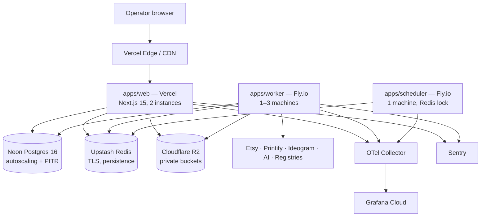

# 17 — Deployment Architecture

**Version:** 1.0

---

## 1. Environments

| Env | Purpose | Data | Providers | Access |
|---|---|---|---|---|
| `local` | Development | Seeded fixtures | All mocked (`MOCK_PROVIDERS=true`) | Developer machine |
| `test` | CI | Ephemeral, per-run | All mocked/fixtures | CI runners only |
| `preview` | Per-PR review app | Branch-seeded copy of the fixture set | Mocked, except a sandbox Etsy shop | Team, password-protected |
| `staging` | Pre-production verification | Anonymised subset | **Real** providers, sandbox Etsy shop, real Printify test shop, capped AI budget | Team |
| `production` | Live | Real | Real | Operator |

**Rule:** production data is never copied downward. Staging is seeded from a synthetic generator that reproduces the *shape* and *volume* of production without the content.

---

## 2. Hosting topology

### Phase 1 (single user) — managed everything



**Rationale:** Vercel for the web tier because Next.js deployment is a solved problem there and the operator benefits from edge caching. Fly.io for workers because they need long-running processes, more memory for image processing, and independent scaling — serverless functions are the wrong shape for a 12-minute pipeline step. Neon for Postgres because branching gives us production-shaped preview databases cheaply. Everything is standard: no proprietary runtime API appears in application code (NFR-V1), so this topology is a preference, not a lock-in.

### Stage 2–3 (SaaS) — same shape, more of it

Web autoscales; workers split into classes (analysis, vision, artwork, publish, sync) with independent scaling policies; Postgres gains a read replica and PgBouncer; Redis moves to a dedicated cluster; a WAF sits in front of the edge.

---

## 3. Containerisation

Only the worker and scheduler are containerised in Phase 1 (the web tier uses the platform's build). Both share one multi-stage Dockerfile.

```dockerfile
FROM node:22-slim AS base
RUN corepack enable
WORKDIR /app

FROM base AS deps
COPY pnpm-lock.yaml pnpm-workspace.yaml package.json ./
COPY packages/*/package.json packages/
COPY apps/*/package.json apps/
RUN pnpm install --frozen-lockfile --prod=false

FROM deps AS build
COPY . .
RUN pnpm turbo build --filter=@pod/worker...

FROM base AS runtime
# image processing dependencies (sharp, vectoriser, segmentation runtime)
RUN apt-get update && apt-get install -y --no-install-recommends \
    libvips libjpeg62-turbo libpng16-16 && rm -rf /var/lib/apt/lists/*
COPY --from=build /app/node_modules ./node_modules
COPY --from=build /app/apps/worker/dist ./dist
COPY --from=build /app/packages ./packages
USER node
ENV NODE_ENV=production NODE_OPTIONS="--max-old-space-size=1536"
HEALTHCHECK --interval=30s --timeout=5s --retries=3 CMD node dist/health.js
CMD ["node", "dist/index.js"]
```

**Constraints:** non-root user, read-only root filesystem with a writable `/tmp` for image processing, pinned base image digest, no build tooling in the runtime layer, image scanned by Trivy before push.

---

## 4. Infrastructure as code

```
infra/
  terraform/
    modules/
      database/        Neon project, branches, roles, PITR config
      redis/           Upstash database, TLS, eviction policy
      storage/         R2 buckets, lifecycle rules, CORS, signed-URL policy
      worker/          Fly app, machines, secrets, scaling policy
      monitoring/      Grafana stack, alert rules, dashboards as code
      dns/             Records, CAA, email auth (SPF/DKIM/DMARC)
    environments/
      staging/         main.tf, terraform.tfvars
      production/      main.tf, terraform.tfvars
  docker/
    Dockerfile.worker
    docker-compose.yml         # local: postgres, redis, minio, mailhog, jaeger
  scripts/
    bootstrap.sh  seed.ts  restore-drill.sh  rotate-keys.sh
```

**Rules:** state in a remote backend with locking; no manual console changes (drift detection runs nightly and alerts); `plan` posted to every infrastructure PR; `apply` gated on approval; secrets never in `.tf` or state — referenced from the platform secret store.

---

## 5. CI/CD

```mermaid
flowchart LR
    PR[Pull request] --> L[Lint · typecheck · dep-cruiser]
    L --> UT[Unit tests + coverage gate]
    UT --> IT[Integration tests<br/>fixtures + ephemeral PG/Redis]
    IT --> AI[AI eval fast suite]
    AI --> SEC[SAST · secrets · deps · container scan]
    SEC --> BUILD[Build web + worker]
    BUILD --> E2E[Playwright E2E<br/>mocked providers]
    E2E --> PERF[Lighthouse + k6 budget check]
    PERF --> PREV[Deploy preview + Neon branch]
    PREV --> REV[Review + approve]
    REV --> MAIN[Merge to main]
    MAIN --> MIG[Run migrations — expand phase]
    MIG --> STG[Deploy staging]
    STG --> SMOKE[Staging smoke suite]
    SMOKE --> GATE{Manual approval}
    GATE --> PROD[Deploy production — rolling]
    PROD --> VER[Post-deploy verification]
    VER --> OBS[Watch error rate + latency 15 min]
    OBS -->|regression| RB[Auto-rollback]
```



**Gates that block merge:** any lint/type error · coverage below 80% on `packages/domain` · any failing test · critical/high SAST or dependency finding · any secret hit · AI eval regression beyond threshold · performance budget exceeded · a breaking OpenAPI diff without an ADR and label.

**Deploy cadence:** trunk-based, merge to `main` deploys to staging automatically; production deploys on demand behind manual approval, typically daily. Feature flags decouple deploy from release (NFR-OP2).

---

## 6. Database migrations

**Expand/contract, always** (NFR-M6). Every migration must be compatible with the currently deployed application version.

```
Release N:    ADD nullable column          (expand)
Release N:    backfill in batches via a job, monitored
Release N+1:  application writes both old and new
Release N+2:  application reads new only
Release N+3:  DROP old column              (contract)
```

| Rule | Detail |
|---|---|
| Ordering | Migrations run **before** the new application version is deployed |
| Locks | `CREATE INDEX CONCURRENTLY`; `lock_timeout = 3s` and `statement_timeout` on all DDL so a migration fails fast rather than blocking the application |
| `NOT NULL` | Added via `CHECK (...) NOT VALID` → `VALIDATE CONSTRAINT` → then the column constraint |
| Backfills | Batched (5k rows), rate-limited, resumable, run as a job — never inside the migration |
| Rollback | Every migration ships with either a tested down-script or an explicit "forward-only + compensating action" note |
| Testing | Every migration runs against a production-shaped seed in CI, with timing recorded; anything over 30 s is flagged for review |
| Partitions | Managed by a scheduled job, not by migrations |

---

## 7. Zero-downtime deployment

| Tier | Mechanism |
|---|---|
| Web | Platform-native atomic deploy with instant rollback; old and new versions coexist briefly, which the expand/contract rule already accounts for |
| Worker | Rolling restart, one machine at a time; `SIGTERM` → stop accepting new jobs → finish in-flight jobs (60 s grace) → exit. Jobs not finished within the grace period are returned to the queue and are safe to retry by construction. |
| Scheduler | Stop old leader → lock released → new leader acquires within 30 s; cron jobs are idempotent so a missed or duplicated tick is harmless |
| Long-running steps | Steps exceeding the grace period are marked `running` with a stale heartbeat and reaped/requeued by the maintenance job (doc 9 §3.3) |

---

## 8. Configuration and secrets

**Configuration** is environment variables only, validated at boot by a Zod schema. The process exits with a precise message on invalid config rather than failing at first use (NFR-OP7).

```ts
const Env = z.object({
  NODE_ENV: z.enum(['development','test','production']),
  DATABASE_URL: z.string().url(),
  DATABASE_REPLICA_URL: z.string().url().optional(),
  REDIS_URL: z.string().url(),
  STORAGE_ENDPOINT: z.string().url(),
  STORAGE_BUCKET: z.string(),
  KMS_KEY_ID: z.string(),
  AI_API_KEY: z.string().min(20),
  AI_MODEL_MAP: z.string(),                  // JSON: tier → model id
  IDEOGRAM_API_KEY: z.string().optional(),
  ETSY_CLIENT_ID: z.string(),
  ETSY_REDIRECT_URI: z.string().url(),
  APP_URL: z.string().url(),
  SESSION_SECRET: z.string().min(32),
  OTEL_EXPORTER_OTLP_ENDPOINT: z.string().url().optional(),
  MOCK_PROVIDERS: z.coerce.boolean().default(false),
  RUN_CONCURRENCY_LIMIT: z.coerce.number().default(3),
  MONTHLY_BUDGET_AMOUNT: z.coerce.number().default(15000),
})
```

**Secrets** live in the platform secret store, injected at runtime, rotated on a documented schedule with a runbook per secret. `MOCK_PROVIDERS=true` is rejected outright when `NODE_ENV=production`.

---

## 9. Observability in production

| Signal | Tool | Retention |
|---|---|---|
| Logs | Structured JSON → platform log drain → Grafana Loki | 30 days hot, 12 months for audit events |
| Traces | OpenTelemetry → Grafana Tempo | 7 days, 100% sampling at Phase 1 volumes |
| Metrics | Prometheus format → Grafana Mimir | 13 months |
| Errors | Sentry with source maps and release tagging | 90 days |
| Uptime | External synthetic checks every 60 s from three regions | 12 months |
| Cost | `ai_calls` + `provider_calls` → daily rollup → dashboard | Indefinite |

**Dashboards (as code, in `infra/terraform/modules/monitoring`):** System Health · Pipeline (runs, steps, durations, failure reasons) · Cost (spend by provider/run/day vs budget) · Provider Health (latency, errors, quota, breaker state) · Business (products published, revenue, prediction accuracy) · Queues (depth, age, throughput, DLQ).

**Alerts** — each with severity, threshold, and a runbook link (an alert without a runbook is a defect, NFR-O7):

| Alert | Threshold | Sev |
|---|---|---|
| API error rate | > 1% over 5 min | High |
| Run failure rate | > 5% over 15 min | High |
| Queue age | p95 > 10 min | High |
| Provider breaker open | > 5 min | High |
| Publish failure | any | **Critical** |
| Etsy token expiring | < 3 days | High |
| Budget consumed | 90% of monthly | High |
| DB connections | > 80% | High |
| Replica lag | > 30 s | Medium |
| Disk / storage growth | > 20% week-on-week | Medium |
| Legal engine failure | any | **Critical** |
| Cost anomaly | single run > 3× expected | Medium |

---

## 10. Backup and disaster recovery

| Asset | Method | RPO | RTO |
|---|---|---|---|
| Postgres | Continuous WAL archiving + PITR; nightly logical dump to separate storage | 5 min | 1 h |
| Object storage | Bucket versioning + cross-region replication | ~0 | 30 min |
| Redis | Ephemeral by design — no durable state; queues rebuild from `run_steps` | n/a | 5 min |
| Secrets | Platform-managed with versioning; offline encrypted escrow for break-glass | n/a | 1 h |
| IaC state | Remote backend with versioning | ~0 | 15 min |

**Recovery scenarios**

| Scenario | Procedure | Target |
|---|---|---|
| Accidental data deletion | Soft-delete restore (30-day bin) | Minutes |
| Bad migration | Roll back the app; forward-fix the schema; restore from PITR only if data was destroyed | < 1 h |
| Database corruption/loss | PITR restore to a new instance, repoint, replay queues from `run_steps` | < 2 h |
| Region outage | Restore into a secondary region from replicated backups; DNS failover | < 4 h (Phase 1), < 30 min (Stage 3 with warm standby) |
| Credential compromise | Kill switches → revoke all tokens → invalidate sessions → rotate → audit | < 15 min to contain |
| Provider permanently unavailable | Adapter swap behind the existing interface | Days, not a rewrite |

**Restore drills are monthly and recorded** (NFR-OP4). A backup that has not been restored is a hypothesis, not a backup.

---

## 11. Runbooks

Every runbook lives in `docs/runbooks/` and follows one template: **Symptom · Detection signal · Immediate mitigation · Diagnosis steps · Resolution · Verification · Prevention follow-up**.

| Runbook | Covers |
|---|---|
| `stuck-run.md` | Steps `running` with stale heartbeat; reaper behaviour; manual requeue |
| `queue-backlog.md` | Diagnosing depth vs age; scaling; identifying the poisoning job |
| `provider-outage.md` | Breaker state; user comms; resumption |
| `budget-exhausted.md` | Raising caps; identifying the runaway step; refund path |
| `etsy-reauth.md` | Token revocation; resuming `needs_reauth` jobs |
| `duplicate-listing.md` | Detection, reconciliation, deletion of the duplicate, root-cause capture |
| `bad-scoring-config.md` | Reverting an activated config; rescoring |
| `database-failover.md` | Promotion, connection repoint, verification |
| `credential-compromise.md` | Kill switches, rotation, audit, notification |
| `restore-drill.md` | Monthly PITR restore verification |
| `cost-spike.md` | Identifying the cause; throttling; retrospective |

---

## 12. Release management

- **Versioning:** semantic on the application; every deploy tagged and linked to its commit range and migration set.
- **Release notes:** generated from Conventional Commits, reviewed for accuracy.
- **Feature flags:** every new engine ships disabled and is enabled deliberately, with the flag removed within two releases of full rollout.
- **Rollback:** application rollback is one action (platform-native). Schema rollback is deliberately *not* the default path — expand/contract means the previous version keeps working against the new schema.
- **Post-deploy verification:** automated smoke suite (auth, start a mocked run, load a report, create a mocked draft) plus a 15-minute watch on error rate and latency with automatic rollback on regression.
- **Change freeze:** none in Phase 1 (single operator, low blast radius). At SaaS, freeze during high-traffic commercial periods (Q4).
