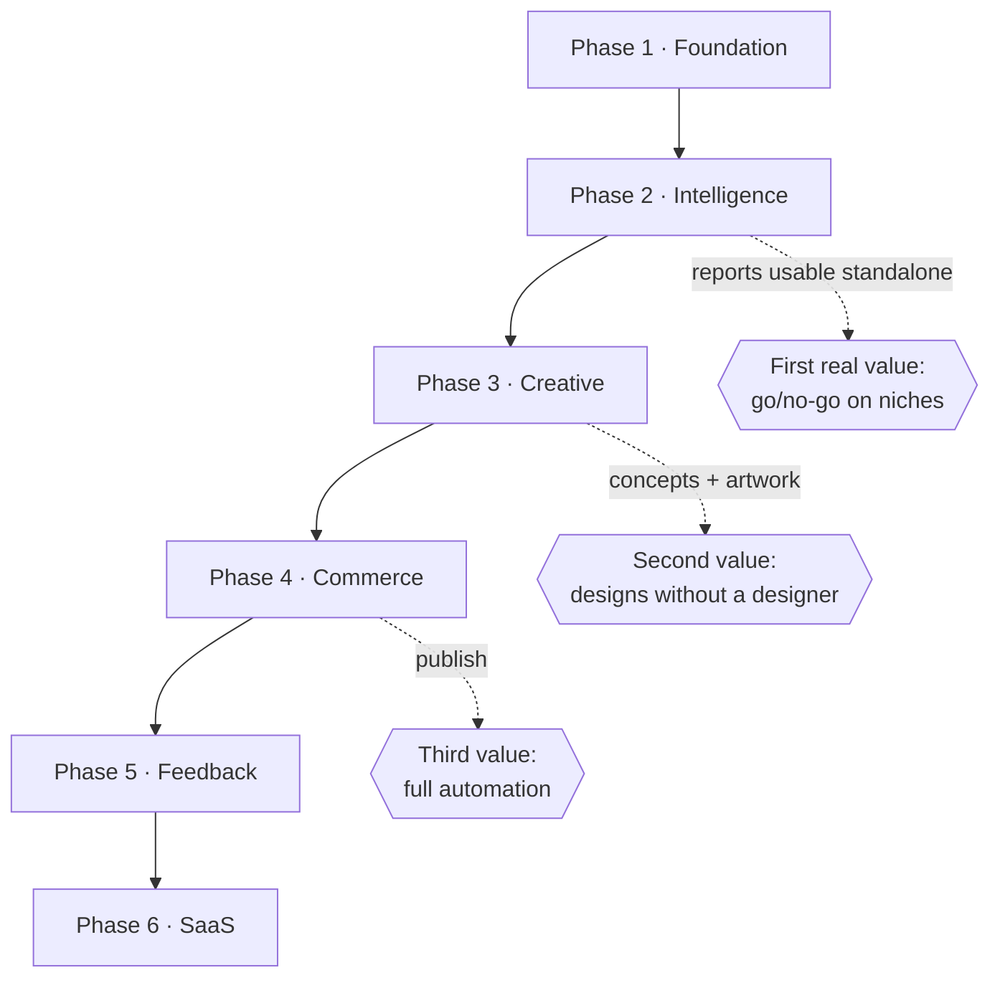

# 19 — Development Roadmap

**Version:** 1.0 · Basis: one full-stack engineer at ~35 productive hours/week, or two engineers at roughly 60% of the stated duration. Estimates are effort, not calendar.

---

## 1. Phase overview

| Phase | Name | Duration | Cumulative | Delivers |
|---|---|---|---|---|
| 0 | Architecture | done | — | This specification set |
| 1 | Foundation | 3 weeks | 3 | Runnable skeleton: monorepo, DB, auth, orchestrator, adapters with fixtures, UI shell |
| 2 | Intelligence Core | 5 weeks | 8 | Steps 1–6 — the research pipeline and all four report types |
| 3 | Creative Core | 4 weeks | 12 | Steps 7–10 — predictor, concepts, legal gate, artwork |
| 4 | Commerce Core | 4 weeks | 16 | Steps 11–15 — products, SEO, Printify, Etsy, publish |
| 5 | Feedback Core | 3 weeks | 19 | Step 16 — analytics, performance sync, learning loop |
| 6 | SaaS Readiness | 4 weeks | 23 | Multi-user, billing, teams, metering, public API |

**Phase 1–5 = 19 weeks to a complete single-user system.** Phase 6 begins only after the operator has used the system for at least one full month and the value is demonstrated — building SaaS infrastructure before proving the product is the most common way this kind of project dies.

---

## 2. Phase 1 — Foundation (3 weeks)

**Goal:** every architectural seam exists and is exercised end to end, with fake data. Nothing is left to "we'll figure out the orchestrator later".

### Sprint 1.1 — Skeleton (week 1)
- Monorepo: pnpm workspaces, Turborepo, TS configs, ESLint, Prettier, dependency-cruiser rules.
- `packages/contracts`, `packages/config` with env validation.
- Postgres + Prisma: full schema from doc 6, migrations, partition helpers, RLS policies (written, not yet enforced).
- Seed script producing a realistic completed run: 10 shops, 400 listings, reports, 20 concepts, 4 artworks, 2 listings.
- Docker Compose local stack; `pnpm dev` runs everything.
- CI: lint, typecheck, test, build.

### Sprint 1.2 — Platform (week 2)
- Auth: password (Argon2id), TOTP, sessions, lockout, recovery codes.
- Redis, BullMQ, `packages/queue` abstraction, DLQ.
- `packages/orchestrator`: DAG definition, step runner, budget guard, heartbeats, reaper, resume.
- `packages/observability`: structured logs, OTel tracing, metrics, cost telemetry.
- Adapter skeletons for all providers with fixture-backed fakes and the universal contract (retry, rate limit, breaker, schema validation).

### Sprint 1.3 — Shell (week 3)
- Next.js app shell: layout, nav, theming, design tokens, core `packages/ui` components.
- tRPC wiring, middleware chain, error model, idempotency.
- SSE progress endpoint with Redis pub/sub fan-out and reconnection.
- A **demo pipeline**: three fake steps that run, stream progress, cost money (fake), fail, retry and resume.
- Settings → Integrations page with connection health.
- Deploy to staging.

**Exit criteria:** a run can be started, watched live, cancelled, resumed after a worker kill, and produces identical output; CI is green; the app is deployed and reachable; zero real provider calls required to develop.

**Risk in this phase:** under-investing in the orchestrator because it produces no visible feature. Resist. Everything after depends on it.

---

## 3. Phase 2 — Intelligence Core (5 weeks)

**Goal:** the research pipeline works on real data and produces the four reports. This is the phase that proves the product thesis.

### Sprint 2.1 — Data acquisition (week 4)
- `MarketDataProvider` interface, chain resolution, field-level merge, provenance.
- `etsy_public` adapter: OAuth, shop/listing reads, taxonomy, rate limiter with reserved quota.
- `manual_csv` + `fixture` adapters; CSV import UI with mapping inference.
- Capability probing and the degradation framework.

### Sprint 2.2 — Competitor engine (week 5)
- Shop discovery, selection scoring with the <3-year preference, 20/10/5 fallback ladder.
- Listing collection with caps and truncation reporting.
- Snapshot persistence, asset download, content-hash dedupe.
- Competitor report UI: shop table, listing table, distributions, detail drawer.

### Sprint 2.3 — Style extraction (week 6)
- Deterministic palette extraction (CIELAB k-means) and palette-family mapping.
- Vision classification: typography, layout, mockup, subject, humour — batched, cached by image hash.
- Embeddings + pgvector indexes.
- Golden-set eval suite for classification accuracy (gate: macro-F1 ≥ 0.85 typography, ≥ 0.80 layout).

### Sprint 2.4 — Opportunity + Success/Failure (week 7)
- `packages/domain/stats`: cohorts, contingency tables, lift, significance, effect size, optimal bands, correlations, interactions — with property tests.
- Opportunity engine: five sub-scores, sub-niche discovery, seasonality, verdict, executive summary.
- Success engine: weighted factors, synthesis card, auto-style resolution.
- Failure engine: anti-factors, causality labelling, crowded losers, Do/Avoid sheet.

### Sprint 2.5 — Gaps + polish (week 8)
- Coverage matrix, demand estimation, demand floor, Gap Opportunity Score, ranking, caution flags.
- Gap report UI: bubble map, ranked list, coverage heatmap.
- `everbee_csv` adapter with format detection.
- Report exports (PDF/CSV); run history, clone, diff.

**Exit criteria:** a real niche produces all four reports in under 11 minutes for under £1.20, with every factor showing cohort support, baseline, lift, n and confidence; degradation paths verified by disabling each capability.

**Commercial action this phase:** approach EverBee regarding API/partner access; record the outcome in doc 11.

---

## 4. Phase 3 — Creative Core (4 weeks)

### Sprint 3.1 — Predictor + Concepts (week 9)
- Design Success Predictor: five dimensions, contribution vectors, reasoning rendering, banding.
- Concept engine: 10 success-derived + 10 gap-derived, structured output, embedding dedupe within-run and against history, quota refill.
- Concept board UI with selection, regeneration, manual entry, expansion.
- Groundedness eval: every cited factor/gap must exist and match its stored statistic (gate: 100%).

### Sprint 3.2 — Legal & Safety (week 10)
- Entity extraction; internal blocklist; USPTO/EUIPO/UKIPO adapters with 30-day caching.
- Copyright risk classification; the deterministic risk rule table.
- Safer-alternative generation and re-screening.
- Service-layer gate enforcement; override flow with step-up auth and audit.
- Adversarial safety eval (gate: recall ≥ 0.98 on `blocked`/`high`).

### Sprint 3.3 — Artwork generation (week 11)
- Brief generation and editing; style templates per design style.
- Ideogram adapter; variant generation; seed determinism; cost accounting.
- Background removal chain with edge refinement; auto-crop; upscale.

### Sprint 3.4 — Artwork QA & Studio (week 12)
- Print-readiness QA with all criteria and remedies.
- Renditions, embeddings, originality check, vectorisation.
- Artwork safety re-screen.
- Artwork Studio UI: canvas, variants, QA panel, originality panel, tools, lineage.

**Exit criteria:** a selected concept produces four print-ready variants for under £0.60 including retries; a blocked concept cannot generate artwork even via a direct API call; QA correctly fails each criterion in isolation.

---

## 5. Phase 4 — Commerce Core (4 weeks)

### Sprint 4.1 — Catalogue & recommendation (week 13)
- Printify adapter; blueprint/provider/variant sync with daily cost refresh and change alerting.
- `packages/domain/pricing`: full fee stack, both offsite-ads cases, price solve, margin floor.
- Product recommendation engine and ranked table UI.
- Pricing panel with cost waterfall and competitor price context.

### Sprint 4.2 — SEO (week 14)
- Keyword pool construction (TF-IDF × sales weighting), 10 variations along declared axes.
- Hard validators, auto-repair, quality scoring and ranking.
- SEO workspace UI with live validation and keyword evidence drawer.
- Constraint-compliance eval (gate: 100% after repair).

### Sprint 4.3 — Printify build (week 15)
- Artwork upload with dedupe; product creation with computed placement; placement editor.
- Mockup polling/webhooks, selection, ordering, quality gate.
- Idempotency and reconciliation; error mapping to remedies.

### Sprint 4.4 — Etsy publish (week 16)
- Draft creation, image upload with per-image retry, inventory with SKU mapping.
- Publish operation with server-side checklist re-evaluation.
- Final Review page: everything on one screen, itemised profit, checklist, confirmation.
- Duplicate-prevention tests including timeout-after-success reconciliation.

**Exit criteria:** end-to-end from niche to live Etsy listing in under 25 minutes of wall clock and under 8 minutes of operator attention; zero duplicates under chaos testing; publish blocked server-side when any hard check fails.

---

## 6. Phase 5 — Feedback Core (3 weeks)

### Sprint 5.1 — Performance tracking (week 17)
- Daily performance sync (6-hourly for the first week post-publish); immutable snapshots.
- Derived metrics: views/day, conversion, days-to-first-sale, age-normalised percentiles.
- Drift detection between local and remote listing state.
- Listing detail page with full lineage breadcrumbs.

### Sprint 5.2 — Analytics (week 18)
- Portfolio, per-niche, per-origin (success vs gap) dashboards.
- Prediction accuracy: scatter, calibration curve, Brier score, per-dimension predictive power.
- Cost dashboard with projections.
- Notifications for first sale, deactivation, zero-views-after-14-days.

### Sprint 5.3 — Learning loop (week 19)
- `outcome_features` construction and feature-set versioning.
- Recalibration job: time-split fit, shrinkage toward prior, back-testing.
- Proposal UI: weight diff, back-test results, activate/reject with note, revert.
- Re-score-history for comparison; minimum-n guard with honest UI messaging.
- Proxy-model calibration for the `etsy_public`-only path using realised sales.

**Exit criteria:** a scoring config proposal is generated from real outcomes, back-tested, reviewed and activated; historical scores are unchanged; the calibration view shows measurable predicted-vs-actual signal.

**Reality check:** with fewer than 50 outcomes the loop will correctly refuse to fit. That is success, not failure — the guard working. Meaningful recalibration realistically arrives 3–6 months after Phase 4 ships.

---

## 7. Phase 6 — SaaS Readiness (4 weeks)

Gated on: the operator has used the system for ≥ 1 month, published ≥ 30 products through it, and can articulate the value in a sentence a stranger would pay for.

### Sprint 6.1 — Multi-tenancy (week 20)
- Enable RLS enforcement (switch the DB role); verify every table's policy.
- Multi-user: invitations, roles, permission matrix enforcement, member management.
- Per-tenant provider credentials; per-tenant rate limiting and quota accounting.
- Cross-tenant isolation test suite (attempt access by id from another workspace on every endpoint).

### Sprint 6.2 — Billing (week 21)
- Stripe: products, prices, checkout, customer portal, webhooks.
- Plan entitlements and enforcement; usage metering (runs, artworks, published products, AI spend).
- Overage handling, dunning, trial, upgrade/downgrade proration.

### Sprint 6.3 — Platform hardening (week 22)
- Per-tenant fair scheduling in the queues.
- Shared market-fact caching (style profiles by image hash, registry results by term) with strict boundaries.
- Public REST API `/v1` + OpenAPI + API keys + outbound webhooks.
- Read replica, PgBouncer, autoscaling policies.

### Sprint 6.4 — Launch readiness (week 23)
- Onboarding flow, marketing site, docs, support tooling.
- Terms, privacy policy, DPAs, subprocessor page.
- Penetration test and remediation.
- Load test at 100× current volume; DR drill; on-call runbook review.

---

## 8. Dependency graph

**Deliberate property:** each phase delivers standalone value. If the project stopped after Phase 2, the operator would still have the best niche-research tool they have ever used. That is what makes the plan survivable.

---

## 9. Milestones and demos

| Milestone | Week | Demo |
|---|---|---|
| M1 — Skeleton runs | 3 | Start a fake run, watch it stream, kill the worker, watch it resume |
| M2 — First real report | 5 | Real competitor analysis on a real niche |
| M3 — Full intelligence | 8 | All four reports on a real niche, with degradation demonstrated |
| M4 — First concepts | 9 | 20 grounded concepts with scores and citations |
| M5 — First artwork | 12 | Print-ready transparent PNG at 300 DPI with a QA report |
| M6 — First draft listing | 16 | An Etsy draft created end to end |
| M7 — First publish | 16 | A live listing, published through the Final Review gate |
| M8 — First learning proposal | 19 | A scoring config proposal with back-test |
| M9 — Second user | 21 | A second workspace with full isolation |
| M10 — First paying customer | 23+ | Stripe subscription active |

---

## 10. Estimation detail (Phase 1–5)

| Workstream | Effort (person-days) |
|---|---|
| Infrastructure, CI/CD, IaC | 12 |
| Database schema + migrations + repositories | 10 |
| Auth + security | 8 |
| Orchestrator + queues + budget | 12 |
| Adapters (6 providers, with fixtures) | 22 |
| Domain maths (scoring, stats, pricing, colour, QA) | 20 |
| Engines (13) | 38 |
| Prompts + eval suites | 14 |
| UI (24 routes, ~60 components) | 42 |
| Charts and data tables | 10 |
| Testing (unit, integration, E2E, load, chaos) | 22 |
| Observability + runbooks | 8 |
| Documentation upkeep | 6 |
| **Total** | **224 person-days ≈ 45 weeks solo at 5 productive days/week** |

The 19-week figure assumes ~2.4 effective engineers (or one engineer with substantial AI-assisted implementation velocity, which is a reasonable assumption for a project of this shape and specification quality). **Plan against the person-day figure, not the week figure.**

---

## 11. Buffers and contingency

| Risk | Buffer |
|---|---|
| Market data access proves harder than expected | +1 week in Phase 2 (CSV path guarantees the phase still lands) |
| Vision classification accuracy below gate | +1 week in Phase 2 for prompt/eval iteration |
| Ideogram output quality requires brief iteration | +1 week in Phase 3 |
| Etsy API edge cases | +1 week in Phase 4 |
| Learning loop has insufficient data | Not a schedule risk — the guard handles it |

**Recommended plan:** 19 weeks + 4 weeks buffer = **23 weeks to a complete single-user system**, with Phase 6 as a separate, later decision.

---

## 12. Definition of done (every phase)

- [ ] All in-scope FRs implemented and traceable to tests by FR id
- [ ] Unit coverage ≥ 80% on touched `packages/domain` code
- [ ] Adapter fixtures cover every endpoint and documented error
- [ ] AI evals pass their gates
- [ ] E2E covers the phase's critical journey
- [ ] Degradation paths tested (each capability disabled in turn)
- [ ] Performance budgets met
- [ ] Cost budgets met and verified by telemetry
- [ ] Observability: dashboards, alerts and runbooks in place
- [ ] Security review completed for the phase
- [ ] Documentation updated (FRs, ERD, ADRs)
- [ ] Deployed to staging, smoke-tested, demoed
